# 시계열 시각화 기법

시계열 데이터(Time-Series Data)는 시간의 흐름에 따라 변화하는 데이터를 의미하며, 이를 효과적으로 시각화하는 것은 데이터 속에 숨겨진 **추세(Trend), 계절성(Seasonality), 이상치(Outlier)** 를 파악하는 데 매우 중요합니다.

---

## 1. 기본적인 변화 추적

가장 직관적으로 데이터의 흐름을 파악할 때 사용합니다.

* **라인 차트 (Line Chart):** 가장 표준적인 방법입니다. X축을 시간, Y축을 수치로 설정하여 변동 추이를 한눈에 보여줍니다.
* **영역 차트 (Area Chart):** 라인 차트 아래쪽을 색상으로 채운 형태입니다. 누적되는 양이나 전체적인 볼륨감을 강조할 때 유용합니다.

## 2. 구성 요소 및 비중 분석

시간에 따른 전체 대비 부분의 비중 변화를 볼 때 유용합니다.

* **누적 막대 차트 (Stacked Bar Chart):** 특정 시점마다 각 항목이 차지하는 비중을 쌓아서 표현합니다.
* **스트림 그래프 (Stream Graph):** 중심축을 기준으로 부드러운 곡선 형태의 층을 쌓아 시간에 따른 변화를 유동적으로 보여줍니다. 데이터의 유입과 유출을 시각화할 사용합니다.

## 3. 밀도 및 분포 확인

데이터가 특정 시간에 얼마나 집중되어 있는지, 혹은 주기성을 띠는지 확인합니다.

* **히트맵 (Heatmap):** 날짜(일)를 X축, 시간대(시)를 Y축으로 설정하여 데이터의 빈도를 색상으로 표현합니다. 특정 요일이나 특정 시간대에 발생하는 패턴을 찾기에 최적입니다.
* **캘린더 뷰 (Calendar View):** 달력 형태로 데이터를 시각화하여 일별 활동량이나 수치를 직관적으로 파악하게 해줍니다. (예: 깃허브 잔디 심기)

## 4. 고급 분석 및 비교

복잡한 패턴이나 여러 지표를 동시에 비교할 때 사용합니다.

* **캔들스틱 차트 (Candlestick Chart):** 주로 주식 시장에서 사용하며, 일정 기간 내의 **시가, 종가, 고가, 저가**를 한 번에 보여줍니다.
* **호라이즌 차트 (Horizon Chart):** 좁은 수직 공간에서 진폭이 큰 시계열 데이터를 효율적으로 보여주기 위해 차트를 겹치고 색상을 다르게 표현하는 기법입니다.
* **시계열 분해 (Time Series Decomposition):** 원본 데이터를 추세(Trend), 계절성(Seasonal), 불규칙 요인(Residual)으로 나누어 각각의 그래프로 시각화합니다.

---

| 기법 | 적합한 상황 | 특징 |
| --- | --- | --- |
| **라인 차트** | 일반적인 추세 분석 | 가장 간결하고 명확함 |
| **히트맵** | 주기적 패턴 발견 | 시간대별 밀집도 파악 용이 |
| **캔들스틱** | 금융 데이터 분석 | 가격의 변동 폭 확인 가능 |
| **시계열 분해** | 예측 모델링 전 단계 | 데이터의 구조적 특성 파악 |

---

시계열 데이터를 시각화할 때는 **데이터의 주기(Daily, Monthly 등)** 와 **변동의 크기**를 고려해 적절한 기법을 선택하는 것이 핵심입니다.

## 데이터 시각화 패키지

1. Matplotlib (가장 기초이자 표준)
2. Seaborn (통계 분석의 강자)
3. Plotly (인터랙티브 시각화)
4. Folium (지도 시각화 전용)

---

## 1. Matplotlib (가장 기초이자 표준)

모든 파이썬 시각화 라이브러리의 뿌리입니다.

* **용도:** 아주 세밀한 설정(축 위치, 폰트, 격자 등)이 필요한 모든 종류의 그래프.
* **특징:** 도화지에 그림을 그리듯 하나하나 설정할 수 있어 자유도가 가장 높지만, 코드가 길어질 수 있습니다.
* **한 줄 요약:** "시각화의 근본, 안 쓰려 해도 결국 쓰게 되는 필수템."

## 2. Seaborn (통계 분석의 강자)

Matplotlib을 기반으로 만든 고수준 라이브러리입니다.

* **용도:** 데이터 분포 확인, 상관관계 히트맵, 그룹별 통계 비교.
* **특징:** Pandas 데이터프레임과 찰떡궁합이며, 한 줄의 코드로 복잡한 통계 차트를 완성합니다.
* **한 줄 요약:** "데이터 분석용 그래프를 가장 쉽고 예쁘게 그리는 도구."

## 3. Plotly (인터랙티브 시각화)

정적인 그림이 아니라, 사용자가 반응할 수 있는 그래프를 만듭니다.

* **용도:** 대시보드 구축, 웹 환경 시각화, 주식 차트(줌인/줌아웃 필요시).
* **특징:** 마우스를 올리면 수치가 나타나고, 범례를 클릭해 특정 항목을 껐다 켰다 할 수 있습니다. 3D 그래프와 지도 시각화에도 매우 강합니다.
* **한 줄 요약:** "보고받는 사람이 직접 만져볼 수 있는 화려한 그래프."

## 4. Folium (지도 시각화 전용)

지리 정보를 시각화할 때 사용하는 패키지입니다.

* **용도:** 상권 분석, 인구 밀도 지도, 경로 표시.
* **특징:** OpenStreetMap 기반으로 지도를 띄우고 그 위에 마커를 찍거나 히트맵을 그려줍니다.
* **한 줄 요약:** "데이터를 지도 위에 뿌리고 싶을 때의 정답."

---

## 5 Matplotlib 차트의 종류

Matplotlib은 파이썬 시각화의 '근본'답게 가장 방대한 종류의 그래프를 지원합니다. 거의 모든 형태의 2D, 3D 그래프를 그릴 수 있으며, 사용자가 직접 정의하는 커스텀 그래프도 가능합니다.

### 1. 기본 통계 그래프 (가장 많이 사용)

데이터의 흐름, 비교, 분포를 파악하는 가장 대중적인 방법입니다.

* **`plot()` (Line Chart):** 선 그래프. 시간 추세나 연속적인 데이터 변화를 보여줄 때 사용합니다.
* **`bar()` / `barh()` (Bar Chart):** 막대 그래프. 항목 간의 수치를 비교할 때 사용하며, `barh`는 가로 막대를 그립니다.
* **`hist()` (Histogram):** 히스토그램. 도수분포표를 시각화하여 데이터의 분포와 빈도를 확인합니다.
* **`pie()` (Pie Chart):** 파이 차트. 전체에서 각 부분이 차지하는 비율을 보여줍니다.

---

### 2. 관계 및 분포 분석

변수 간의 상관관계나 밀집도를 정밀하게 분석할 때 사용합니다.

* **`scatter()` (Scatter Plot):** 산점도. 두 변수 사이의 관계를 점으로 나타내어 상관관계를 파악합니다.
* **`boxplot()` (Box Plot):** 박스 플롯. 최솟값, 제1사분위, 중앙값, 제3사분위, 최댓값 및 이상치를 한눈에 보여줍니다.
* **`violinplot()` (Violin Plot):** 데이터의 분포 밀도를 바이올린 모양으로 보여줍니다.
* **`errorbar()`:** 오차 막대. 데이터의 편차나 불확실성을 선과 함께 표시합니다.

---

### 3. 이미지 및 다차원 데이터

2차원 배열이나 행렬 데이터를 시각화할 때 유용합니다.

* **`imshow()` (Image Show):** 이미지 데이터를 출력하거나, 2차원 배열을 색상으로 시각화(Heatmap 형태)합니다.
* **`pcolormesh()`:** 불규칙한 격자의 2차원 배열을 색상으로 채워 표현합니다.
* **`contour()` / `contourf()`:** 등고선 그래프. 3차원 데이터를 평면에 선이나 색상 면으로 나타냅니다.

---

### 4. 특수 및 고급 시각화

수학적, 공학적 목적이나 화려한 시각화가 필요할 때 사용합니다.

* **`stem()`:** 스템 플롯. 이산 신호 처리를 시각화할 때 주로 사용합니다.
* **`stackplot()`:** 누적 영역 그래프. 시간에 따른 각 요소의 합계 변화를 보여줍니다.
* **`quiver()`:** 벡터장 그래프. 화살표를 이용해 방향과 크기를 가진 데이터를 시각화합니다.
* **`polar()`:** 극좌표 그래프. 각도와 반지름을 기준으로 데이터를 배치합니다.

---

### 5. 3차원 그래프 (mplot3d 확장)

`mpl_toolkits.mplot3d`를 사용하여 3차원 공간에 데이터를 뿌립니다.

* **`plot_surface()`:** 3차원 표면 그래프.
* **`plot_wireframe()`:** 와이어프레임 그래프.
* **`scatter3D()`:** 3차원 산점도.

---

Matplotlib은 이 모든 그래프의 **색상, 선 굵기, 폰트, 축 위치** 등을 100% 사용자가 제어할 수 있다는 것이 가장 큰 장점입니다.

---

## 6 Matplotlib 예제 (matplotlib 폴더 참조)

사전 시각화 라이브러리 설치

```PowerShell
#matplotlib 폴더 이동
cd day1\matplotlib

#시각화 라이브러리 설치
pip install -r requirements.txt
```

### 1. 라인 차트 (matplotlib/line.py)

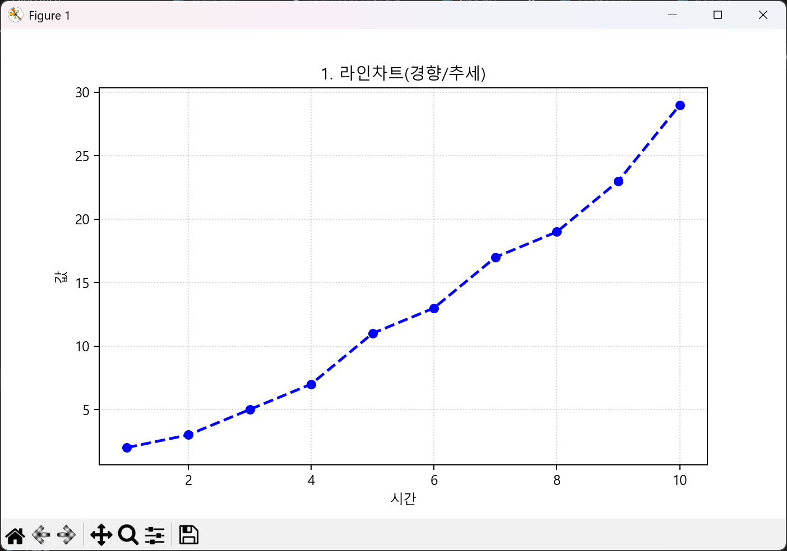

```python
import matplotlib.pyplot as plt
import numpy as np

# 데이터 준비
# 시각화를 위해서는 X축과 Y축의 데이터 개수가 반드시 일치해야 합니다.
x = np.arange(1, 11) #1부터 10까지의 정수 배열 생성 (X축 공통)
y_line = [2, 3, 5, 7, 11, 13, 17, 19, 23, 29] # 소수(Prime Number) 리스트

# -한글 폰트 설정
plt.rcParams['font.family'] = 'Malgun Gothic' # 윈도우OS 맑은 고딕 설정
plt.rcParams['axes.unicode_minus'] = False    # 마이너스 기호 깨짐 방지

#그래프가 그려질 그림의 크기를 설정합니다. 가로 8인치, 세로 5인치 크기입니다.
plt.figure(figsize=(8, 5))

#라인 차트를 그립니다. 시계열 데이터나 연속적인 수치 변화를 표현할 때 씁니다
plt.plot(x, y_line, color='blue', marker='o', linestyle='--', linewidth=2)

# 그래프의 제목입니다. 
plt.title('1. 라인차트(경향/추세)')

# X축과 Y축이 레이블을 설정합니다
plt.xlabel('시간')
plt.ylabel('값')

# 배경에 눈금선을 그려줍니다. 투명도는 0.6
plt.grid(True, linestyle=':', alpha=0.6)

# 차트를 출력합니다 
plt.show()
```

#### 리눅스나 맥에서 한글이 깨질때

```python
# 설치: pip install koreanize-matplotlib
import koreanize_matplotlib
import matplotlib.pyplot as plt

plt.title("이것만 쓰면 한글 자동 설정됩니다")
plt.show()
```


### 2. 바 차트 (matplotlib/bar.py)

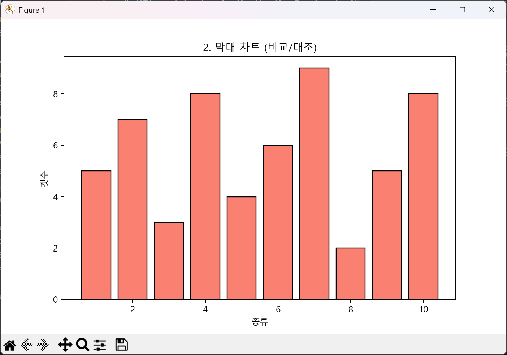

```python
import koreanize_matplotlib # 한글 폰트 설정을 위한 라이브러리입니다. matplotlib에서 한글이 깨지는 문제를 해결해줍니다.
import matplotlib.pyplot as plt
import numpy as np

# 데이터 준비
# 시각화를 위해서는 X축과 Y축의 데이터 개수가 반드시 일치해야 합니다.
x = np.arange(1, 11) #1부터 10까지의 정수 배열 생성 (X축 공통)
y_bar = [5, 7, 3, 8, 4, 6, 9, 2, 5, 8] # 막대용 임의 데이터

#그래프가 그려질 그림의 크기를 설정합니다. 가로 8인치, 세로 5인치 크기입니다.
plt.figure(figsize=(8, 5))

# 막대 차트를 그립니다. 항목 간의 수량을 비교할 때 가장 효과적입니다.
plt.bar(x, y_bar, color='salmon', edgecolor='black')

#그래프의 제목입니다.
plt.title('2. 막대 차트 (비교/대조)')

# X축과 Y축이 레이블을 설정합니다
plt.xlabel('종류')
plt.ylabel('갯수')

# 차트를 출력합니다 
plt.show()
```

### 3. 산점도 차트 차트 (matplotlib/scatter.py)

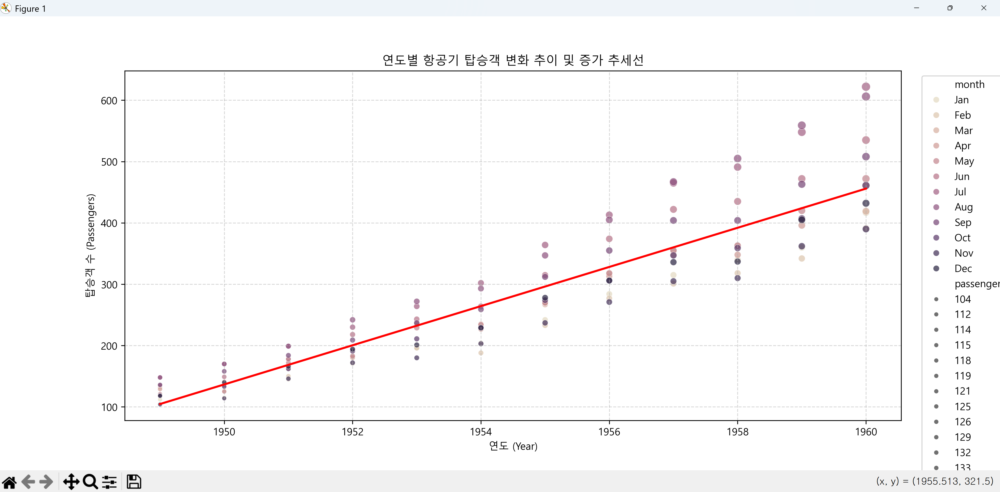
```python
import koreanize_matplotlib # 한글 폰트 설정을 위한 라이브러리입니다. matplotlib에서 한글이 깨지는 문제를 해결해줍니다.
import matplotlib.pyplot as plt
import numpy as np

# 1. 데이터 준비
# 시각화를 위해서는 X축과 Y축의 데이터 개수가 반드시 일치해야 합니다.
x = np.arange(1, 11) #1부터 10까지의 정수 배열 생성 (X축 공통)
y_scatter = np.random.randint(1, 30, 10) # 1~30 사이의 랜덤 정수 10개 생성는 모두 10개로 맞춰져 있습니다.

#그래프가 그려질 그림의 크기를 설정합니다. 가로 8인치, 세로 5인치 크기입니다.
plt.figure(figsize=(8, 5))

# 산점도를 그립니다. 두 변수 사이의 상관관계나 분포를 파악할 때 씁니다.
plt.scatter(x, y_scatter, color='green', s=100, alpha=0.7, edgecolors='white')

# 그래프의 제목입니다. 
plt.title('3. 산점도 차트 (Correlation)')

# X축과 Y축이 레이블을 설정합니다
plt.xlabel('Variable X')
plt.ylabel('Variable Y')

# 차트를 출력합니다 
plt.show()
```

### 4. 여러개의 차트 출력 (matplotlib/chart.py)

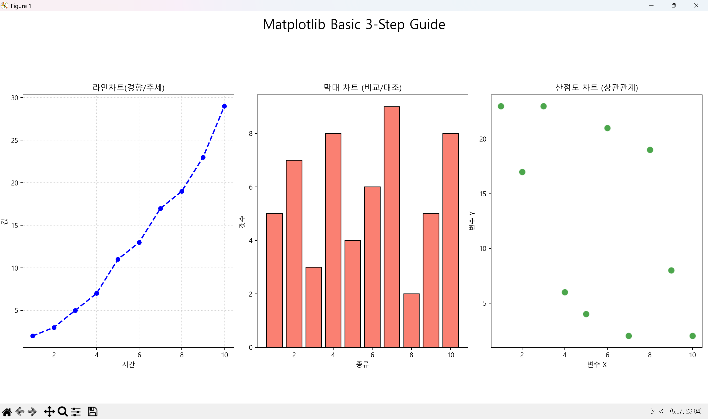

```python
import koreanize_matplotlib # 한글 폰트 설정을 위한 라이브러리입니다. matplotlib에서 한글이 깨지는 문제를 해결해줍니다.
import matplotlib.pyplot as plt
import numpy as np

# 1. 데이터 준비
x = np.arange(1, 11)
y_line = [2, 3, 5, 7, 11, 13, 17, 19, 23, 29] # 소수 데이터
y_bar = [5, 7, 3, 8, 4, 6, 9, 2, 5, 8]
y_scatter = np.random.randint(1, 30, 10)

# 2. 그래프 크기 설정 및 서브플롯 생성 (1행 3열)
fig, axes = plt.subplots(1, 3, figsize=(18, 5))

# --- [그래프 1] 라인 차트 (Line Chart) ---
axes[0].plot(x, y_line, color='blue', marker='o', linestyle='--', linewidth=2)
axes[0].set_title('라인차트(경향/추세)')
axes[0].set_xlabel('시간')
axes[0].set_ylabel('값')
axes[0].grid(True, linestyle=':', alpha=0.6)

# --- [그래프 2] 막대 차트 (Bar Chart) ---
axes[1].bar(x, y_bar, color='salmon', edgecolor='black')
axes[1].set_title('막대 차트 (비교/대조)')
axes[1].set_xlabel('종류')
axes[1].set_ylabel('갯수')

# --- [그래프 3] 산점도 (Scatter Plot) ---
axes[2].scatter(x, y_scatter, color='green', s=100, alpha=0.7, edgecolors='white')
axes[2].set_title('산점도 차트 (상관관계)')
axes[2].set_xlabel('변수 X')
axes[2].set_ylabel('변수 Y')

# 전체 레이아웃 조정 및 제목 추가
plt.suptitle('Matplotlib Basic 3-Step Guide', fontsize=20)
plt.tight_layout(rect=[0, 0.03, 1, 0.95])
plt.show()
```

## 7. Seaborn 차트의 종류 (seaborn 폴더 참조)

Seaborn은 시각화하려는 데이터의 성격(관계, 분포, 카테고리 등)에 따라 함수군을 크게 3가지 계층으로 나누어 제공합니다. 각 계층에는 여러 유형의 그래프가 포함되어 있습니다.

### 1. 연습용 데이터셋

Seaborn은 데이터 시각화 연습을 위해 연습용 데이터셋을 라이브러리 내에 기본적으로 내장하고 있습니다. 별도의 CSV 파일 없이도 `sns.load_dataset('데이터셋이름')` 코드를 통해 바로 불러와 사용할 수 있습니다.

---

#### 1. 가장 자주 사용되는 대표 데이터셋

시각화 튜토리얼에서 자주 사용하는 데이터들입니다.

| 데이터셋 이름 | 내용 | 주요 활용도 |
| --- | --- | --- |
| **iris** | 붓꽃의 종별 꽃잎/꽃받침 길이와 너비 | 분류(Classification), 산점도 |
| **tips** | 식당 손님의 팁, 총 지불 금액, 요일, 성별 등 | 회귀 분석, 범주형 그래프 |
| **titanic** | 타이타닉 호 생존자 정보 (나이, 성별, 좌석 등) | 데이터 정제, 로지스틱 회귀 |
| **penguins** | 팔머 펭귄의 종, 부리 길이, 몸무게 등 | iris를 대체하는 최신 기초 데이터셋 |

#### 2. 시계열 및 수치형 데이터셋

시간의 흐름이나 변화를 파악하기 좋은 데이터들입니다.

* **flights**: 연도 및 월별 항공기 승객 수 (Heatmap 그리기에 최적)
* **dots**: 시간 경과에 따른 자극과 반응 (Lineplot 연습용)
* **fmri**: 뇌 활동(fMRI) 시계열 데이터
* **dowjones**: 다우존스 지수의 역사적 데이터

#### 3. 기타 특수 목적 데이터셋

* **planets**: 발견된 외계 행성들의 정보 (연도, 방법, 거리 등)
* **diamonds**: 다이아몬드의 캐럿, 컷, 가격 (대용량 데이터 처리 연습)
* **car_crashes**: 미국 주별 교통사고 통계
* **geyser**: 올드 페이스풀 간헐천의 분출 대기 시간 및 지속 시간

---

### 2. 그래프 종류

#### 1. 관계형 그래프 (Relational Plots)

두 변수 사이의 상관관계나 흐름을 파악할 때 사용합니다.

* **`scatterplot()`**: 산점도. 두 수치형 변수 간의 관계를 점으로 표현합니다.
  seaborn\scatterplot.py 파일을 참조(1949년부터 1960년까지의 월별 항공 탑승객 수가 기록된 시계열 데이터셋)
  seaborn\scatterplot2.py 파일을 참조(tips 시계열 데이터셋)
  반드시 소스를 확인 해주세요.

  

* **`lineplot()`**: 선 그래프. 시간의 흐름에 따른 추세를 보여줄 때 적합하며, 자동으로 신뢰구간을 계산해 그림자를 그려줍니다.
  seaborn\lineplot.py 파일을 참조
  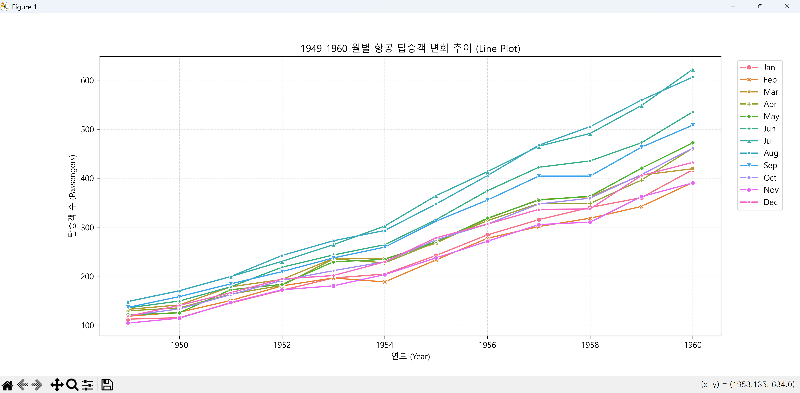

* **`relplot()`**: 위 두 그래프를 포괄하는 상위 함수로, 격자(Facet) 구조를 만들기 용이합니다.
  seaborn\relplot.py 파일을 참조
  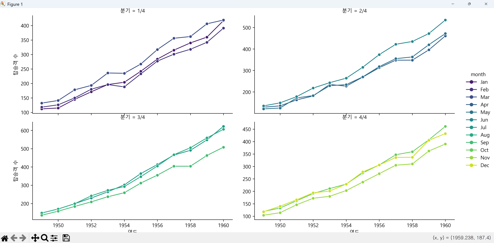

---

#### 2. 분포형 그래프 (Distribution Plots)

변수가 어떤 값을 가지고 있는지, 데이터가 어디에 밀집되어 있는지 확인할 때 사용합니다.

* **`histplot()`**: 히스토그램. 데이터의 빈도를 막대 형태로 보여줍니다.
seaborn\histplot.py 파일을 참조
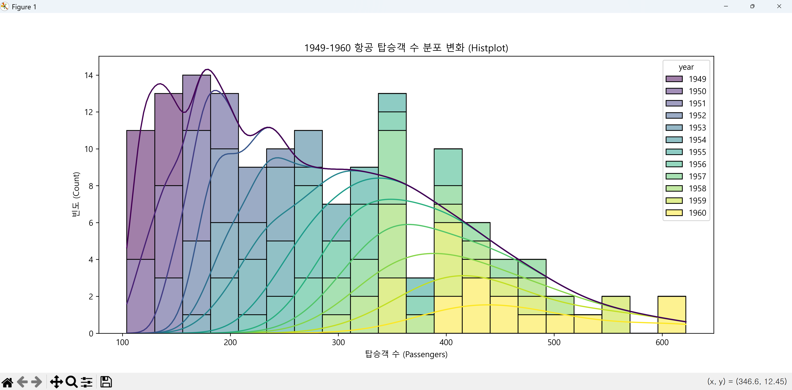

* **`kdeplot()`**: 커널 밀도 추정 그래프. 히스토그램을 부드러운 곡선 형태로 나타냅니다.
seaborn\kdeplot.py 파일을 참조
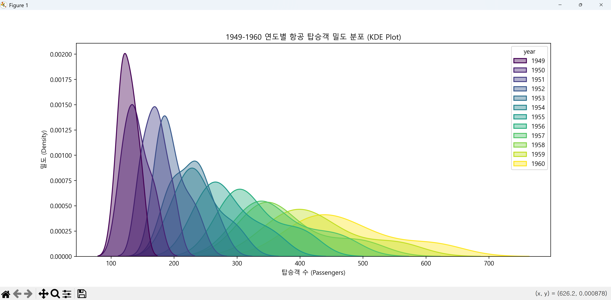

* **`rugplot()`**: 축을 따라 데이터의 위치를 작은 선(Rug)으로 표시합니다.
seaborn\rugplot.py 파일을 참조
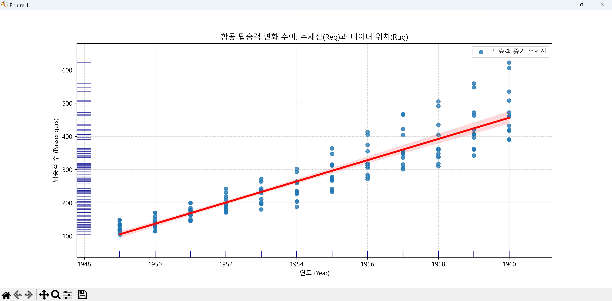

* **`displot()`**: 분포형 그래프를 통합 관리하는 상위 함수입니다.
seaborn\displot.py 파일을 참조
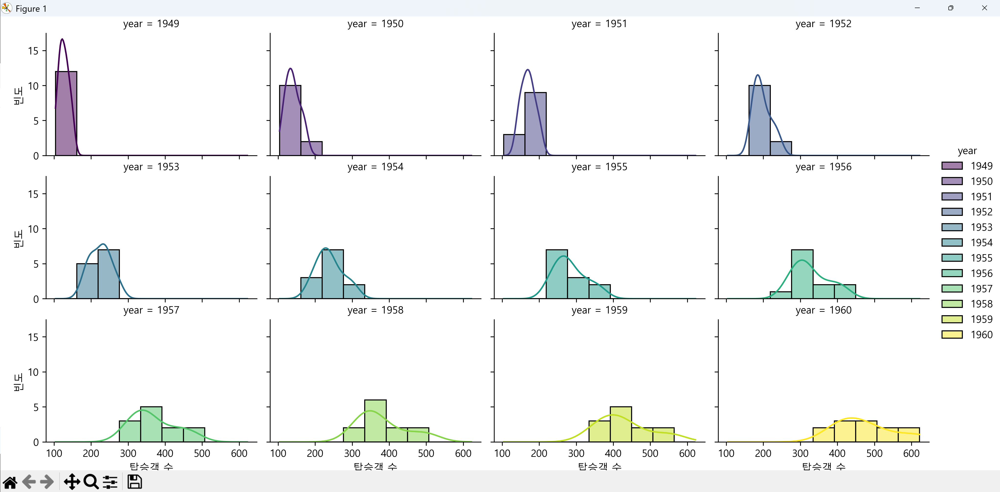

---

#### 3. 범주형 그래프 (Categorical Plots)

그룹별(성별, 지역, 요일 등)로 수치를 비교할 때 가장 많이 사용합니다.

* **비교형:**
* **`barplot()`**: 막대 그래프. 평균값과 신뢰구간(오차 막대)을 함께 보여줍니다.
seaborn\barplot.py 파일을 참조
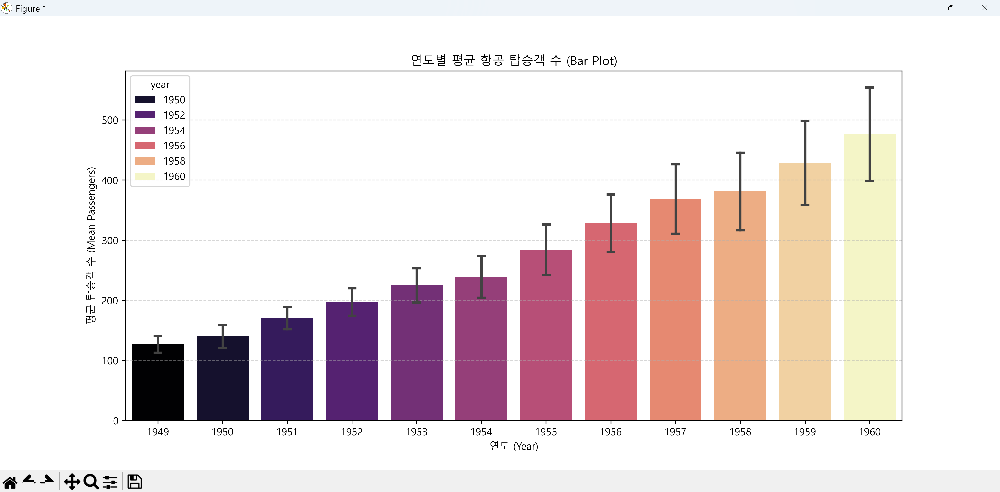

* **`countplot()`**: 각 카테고리별 데이터의 개수(빈도)를 막대로 보여줍니다.
seaborn\countplot.py 파일을 참조
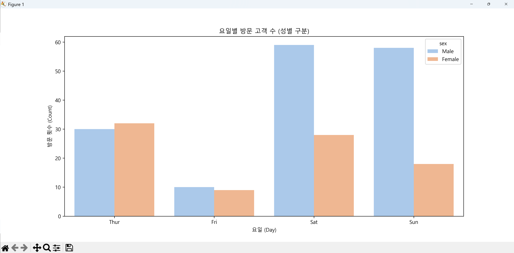

* **분포 비교형:**
* **`boxplot()`**: 박스 플롯. 사분위수와 이상치를 확인하기 좋습니다.
seaborn\boxplot.py 파일을 참조
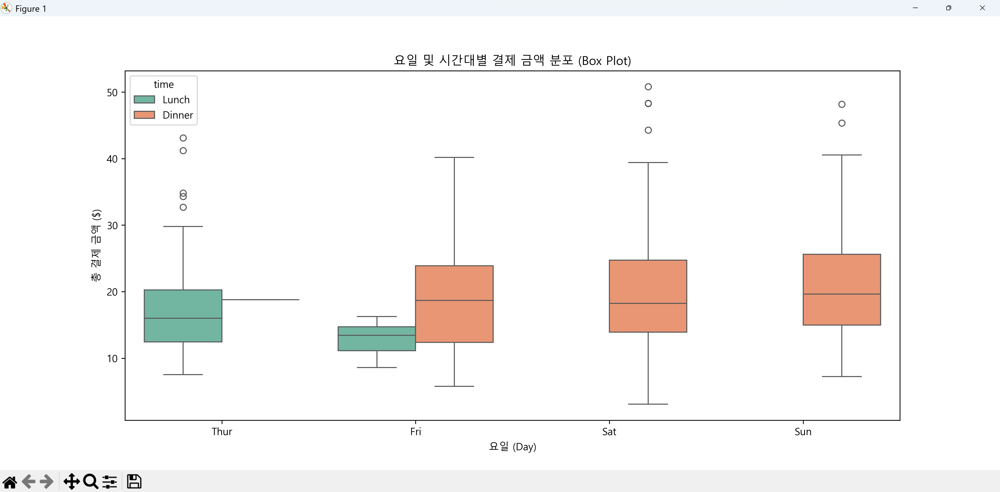

* **`violinplot()`**: 바이올린 플롯. 박스 플롯에 밀도(KDE)를 결합하여 분포의 모양까지 보여줍니다.
seaborn\violinplot.py 파일을 참조
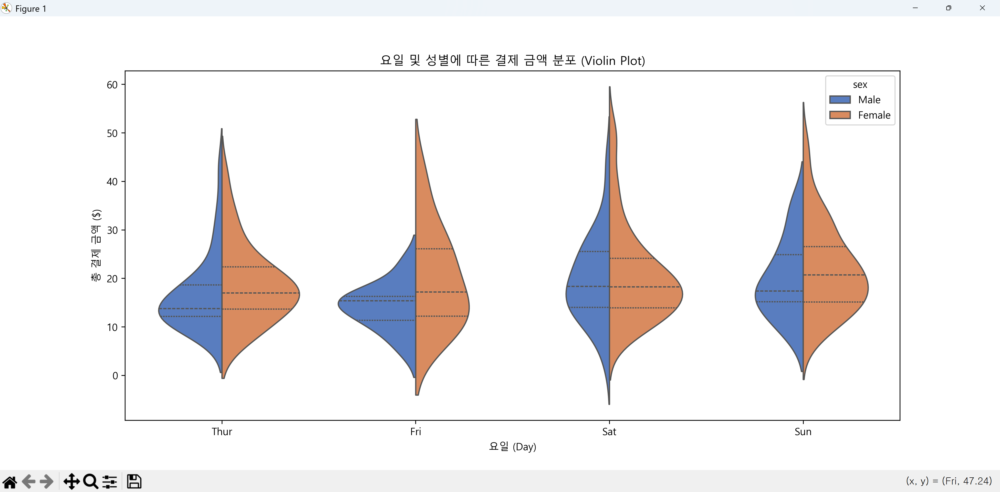

* **분산 비교형:**
* **`stripplot()`**: 범주별 데이터를 점으로 흩뿌려 보여줍니다.
seaborn\stripplot.py 파일을 참조
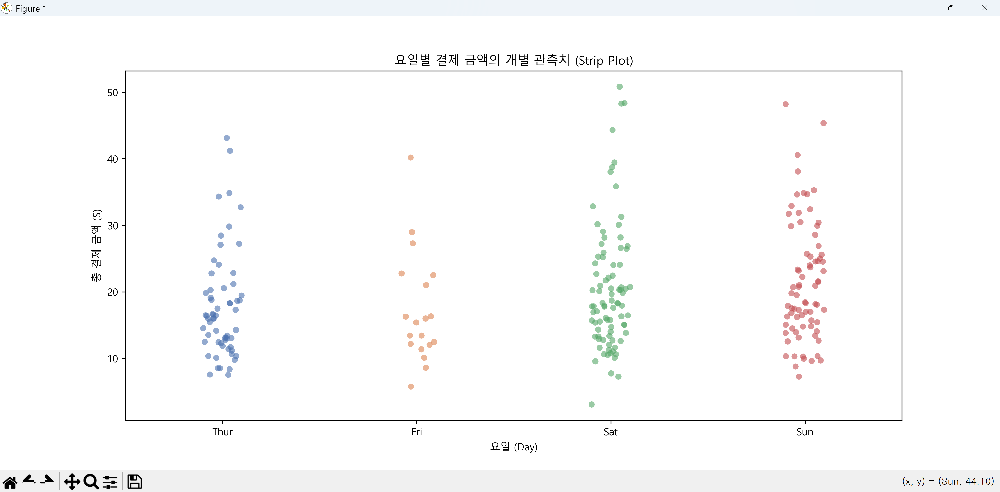

* **`swarmplot()`**: 점들이 겹치지 않게 옆으로 펼쳐서 데이터의 밀집도를 더 정확히 보여줍니다.
seaborn\swarmplot.py 파일을 참조
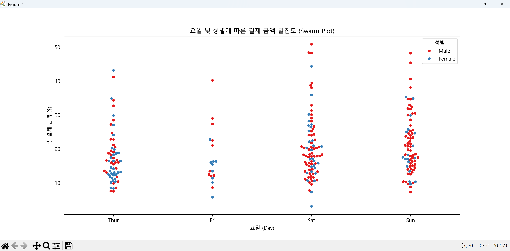

---

#### 4. 다중 그래프 및 매트릭스 (Matrix Plots)

데이터셋 전체의 구조나 여러 변수를 동시에 분석할 때 유용합니다.

* **`heatmap()`**: 히트맵. 변수 간의 상관계수나 밀도를 색상으로 표현합니다.
seaborn\heatmap.py 파일을 참조
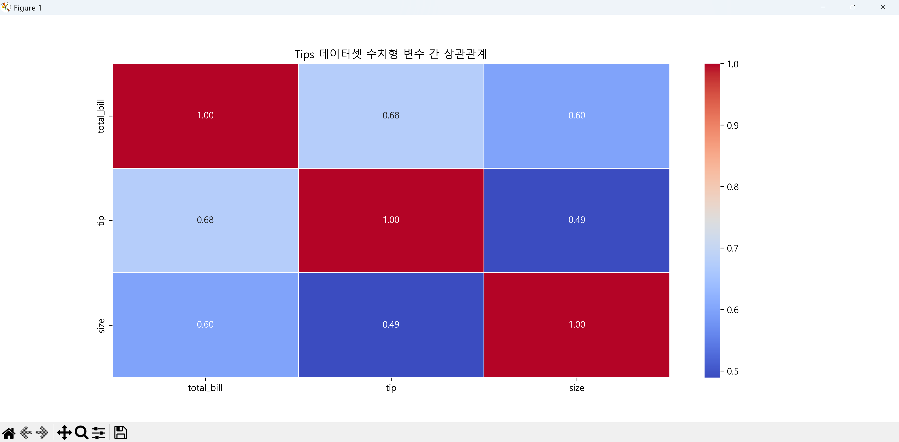

* **`clustermap()`**: 히트맵에 계층적 군집 분석을 더해 비슷한 특성을 가진 데이터끼리 묶어줍니다.
seaborn\clustermap.py 파일을 참조
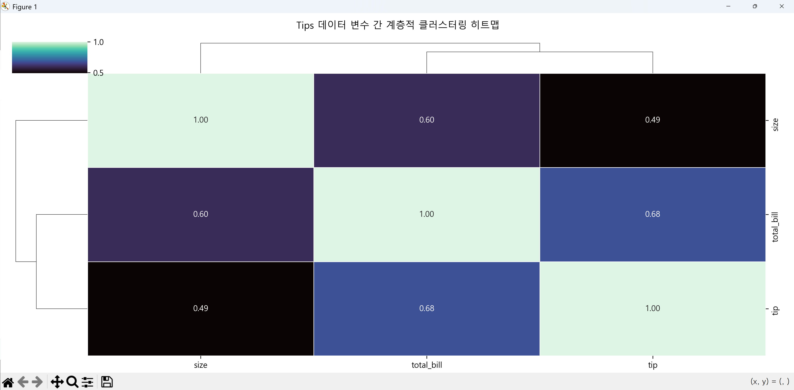

* **`pairplot()`**: 데이터프레임 내 모든 수치형 변수 쌍의 관계를 그리드로 보여줍니다.
seaborn\pairplot.py 파일을 참조
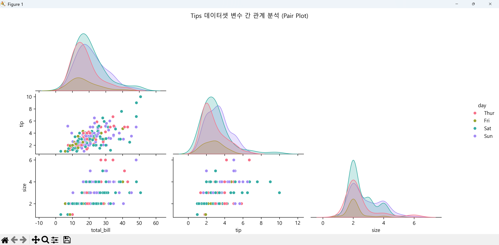

* **`jointplot()`**: 두 변수의 관계(산점도)와 각 변수의 분포(히스토그램)를 결합하여 보여줍니다.
seaborn\jointplot.py 파일을 참조
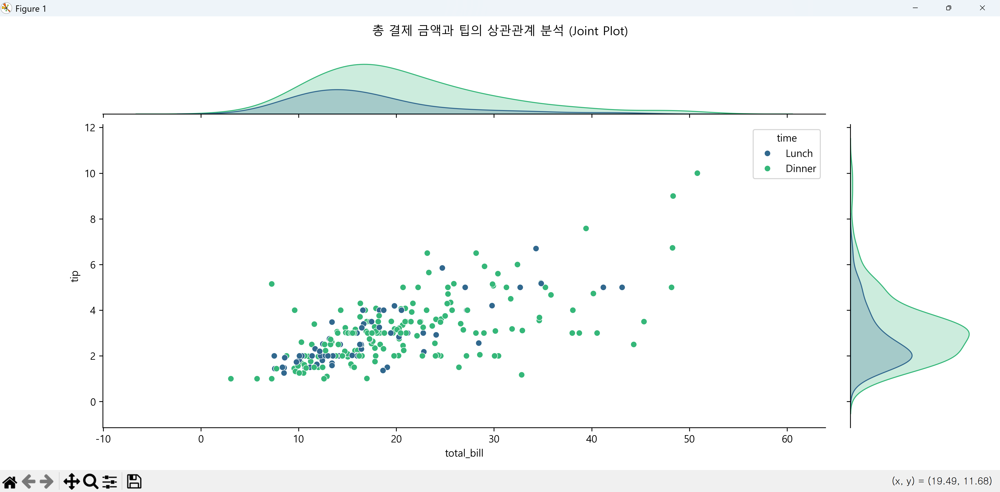

---

#### 5. 어떤 그래프를 선택해야 할까요?

| 분석 목적 | 추천 그래프 |
| --- | --- |
| **두 숫자의 상관관계** | `scatterplot`, `regplot` |
| **시간에 따른 변화** | `lineplot` |
| **그룹별 수치 비교** | `barplot`, `violinplot` |
| **데이터의 편향성/분포** | `histplot`, `kdeplot` |
| **모든 변수 훑어보기** | `pairplot`, `heatmap` |
