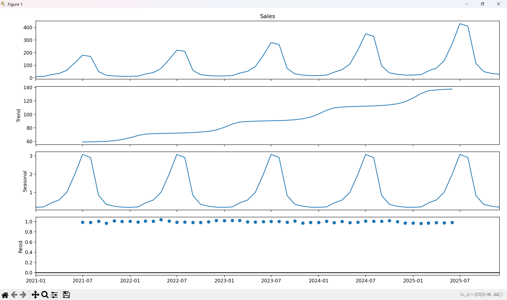

# 시계열 분해(Time Series Decomposition)란

시계열 분해(Time Series Decomposition)란 복잡하게 얽혀 있는 시계열 데이터를 그 구성 요소인 **추세(Trend), 계절성(Seasonality), 잔차(Residual)** 로 나누어 분석하는 기법입니다.

---

## 1. 시계열의 3가지 핵심 요소

데이터가 시간에 따라 변할 때, 보통 다음 세 가지 성분이 합쳐져서 나타납니다.

* **추세 (Trend):** 데이터가 장기적으로 상승하거나 하락하는 경향입니다. (예: 인구 증가, 기술 발전)
* **계절성 (Seasonality):** 일정한 주기(1년, 1주일 등)마다 반복되는 패턴입니다. (예: 여름철 아이스크림 판매량 급증)
* **잔차/불규칙 요인 (Residual/Irregular):** 추세나 계절성으로 설명되지 않는 무작위한 변동입니다. (예: 천재지변, 예기치 못한 사고)

---

## 2. 분해 모델의 종류

데이터의 특성에 따라 두 가지 모델 중 하나를 선택합니다.

| 모델 | 공식 | 특징 |
| --- | --- | --- |
| **가법 모델 (Additive)** | $Data = Trend + Seasonal + Residual$ | 계절성 변폭이 추세와 상관없이 **일정**할 때 사용 |
| **승법 모델 (Multiplicative)** | $Data = Trend \times Seasonal \times Residual$ | 추세가 커짐에 따라 **계절성 변폭도 같이 커질 때** 사용 (현실 데이터에 더 많음) |

---

## 3. 예시1: "에어컨 판매량 데이터"

예제코드 day2\step1 폴더 참조

```python
import pandas as pd
import matplotlib.pyplot as plt
from statsmodels.tsa.seasonal import seasonal_decompose

# 예시 데이터: 월별 항공기 탑승객 수 (Seaborn 등에서 쉽게 구할 수 있음)
# 여기서는 개념 이해를 위해 가상의 데이터를 생성하거나 내장 데이터를 씁니다.
# data = pd.read_csv('https://raw.githubusercontent.com/jbrownlee/Datasets/master/airline-passengers.csv', index_col='Month', parse_dates=True)

# 다음에 실행을 하기위해 데이터를 data 폴도에 저장합니다 
# 아래 코드는 저장된 데이터를 불러옵니다.
# pd.save_csv("./data/airline-passengers.csv")

data = pd.read_csv("./data/airline-passengers.csv", index_col='Month', parse_dates=True)

# 모델 설정: 'multiplicative'(승법 모델)은 변동 폭이 점점 커질 때 주로 사용합니다.
result = seasonal_decompose(data['Passengers'], model='multiplicative')
# 모델 설정: 'Additive'(가법 모델)시간이 지나도 계절 변동의 폭이 일정할 때 사용합니다.
#result = seasonal_decompose(data['Passengers'], model='additive')

# 시각화
plt.rcParams['figure.figsize'] = [10, 8]
result.plot()
plt.show()
```

---

사전 라이브러리 설치

```PowerShell
#day2\step1 폴더 이동
cd day2\step1

#라이브러리 설치
pip install -r requirements.txt
```

---


* **데이터:** "Monthly International Airline Passengers" (월별 국제 항공 탑승객 수).
* **출처:** 통계학의 고전으로 불리는 Box & Jenkins의 저서 《Time Series Analysis: Forecasting and Control》(1976)에 수록된 'Series G' 데이터입니다
* **범위:** 1949년 1월부터 1960년 12월까지 총 144개월(12년치)의 데이터가 담겨 있습니다.
* **전체 흐름:** 전후 항공 산업의 폭발적인 성장세를 보여주는 우상향 곡선, 매년 여름 휴가철에 승객이 집중되는 일정한 패턴, 시간이 흐르고 산업 규모가 커질수록 계절적 오르내림의 폭(진폭)도 함께 커지는 현상

그래프를 그리면 위에서부터 아래로 4개의 차트가 나옵니다.

1. **Observed (원본):** 실제 수집된 데이터입니다. 추세와 계절성이 뒤섞여 있어 복잡해 보입니다.
2. **Trend (추세):** 잡음을 제거하고 데이터가 장기적으로 **우상향**하고 있음을 명확히 보여줍니다. (항공 산업의 성장)
3. **Seasonal (계절성):** 매년 일정한 주기로 오르내리는 패턴을 보여줍니다. (휴가철 급증 등)
4. **Resid (불규칙 요인):** 추세와 계절성으로도 설명되지 않는 나머지 값입니다. 이 값이 너무 크다면 알 수 없는 사건이 많았다는 뜻입니다.

---

### 1. Passengers (원본 데이터: Observed)

* **의미:** 우리가 실제로 수집한 원본 그대로의 데이터입니다.
* **특징:** 시간이 갈수록 전체적인 수치가 높아지고 있으며, 동시에 뾰족뾰족한 산 모양이 매년 반복되는 것을 볼 수 있습니다. 이 그래프만 봐서는 "성장 중인 건 알겠는데, 정확히 매년 몇 퍼센트나 오르는지" 파악하기 어렵습니다.

### 2. Trend (추세 요인)

* **의미:** 자잘한 변동을 다 제거하고 남은 **핵심 성장 곡선**입니다.
* **특징:** 1950년부터 1960년까지 거의 직선에 가깝게 **우상향**하고 있습니다. 이는 항공 산업이 지난 10년간 꾸준히, 그리고 안정적으로 성장했다는 것을 증명합니다.
* **인사이트:** "이 비즈니스는 장기적으로 아주 좋게 성장 중이다!"

### 3. Seasonal (계절 요인)

* **의미:** 1년 단위로 반복되는 **정기적인 패턴**입니다.
* **특징:** 파동의 모양이 매우 일정합니다. 그래프 상에서 높게 솟은 지점은 주로 여름 휴가철(7~8월)일 가능성이 높고, 푹 꺼진 지점은 비수기 입니다.
* **인사이트:** "매년 특정 시기에는 무조건 사람이 몰리니, 이때 맞춰서 비행기를 더 배치해야겠다!"

### 4. Resid (불규칙 요인: Residual)

* **의미:** 추세와 계절성으로도 설명되지 않는 **나머지(잔차)** 입니다.
* **특징:** 점들이 1.0 근처에서 무작위로 흩어져 있습니다. 만약 특정 시점에 점이 아주 크게 위나 아래로 튀었다면, 그 시기에 파업이나 기상 악화 같은 '특이 사건'이 있었음을 의미합니다.
* **인사이트:** 현재 데이터에서는 잔차가 매우 작고 일정합니다. 이는 이 데이터가 **매우 규칙적이고 예측하기 쉬운 데이터**라는 뜻입니다.

---

## 4. 예제2: "에어컨 판매량"

예제코드 day2/step2 폴더 참조

```python
import pandas as pd
import matplotlib.pyplot as plt
from statsmodels.tsa.seasonal import seasonal_decompose

# generate_aircon_sales.py에서 저장한 CSV 파일을 읽어서 사용합니다   
data = pd.read_csv("./data/aircon_sales.csv", index_col='Month', parse_dates=True)

# 2. 시계열 분해 (승법 모델 선택: 추세에 따라 계절 진폭이 커지므로)
# model='multiplicative' (승법) 또는 'additive' (가법)
result = seasonal_decompose(data['Sales'], model='multiplicative')

# 3. 결과 시각화
plt.rcParams['figure.figsize'] = [10, 8]
result.plot()
plt.show()

```

---



가상의 에어컨 판매 데이터를 통해 분해 과정을 살펴봅시다.

* **데이터:** 5년간의 월별 에어컨 판매수량.
* **전체 흐름:** 매년 여름 판매량이 치솟고, 시간이 흐를수록 브랜드 인지도가 높아져 전체 판매량이 우상향함.

### 분해 결과 해석

1. **Original (원본):** 여름마다 뾰족하게 솟아오르며 전체적으로 우상향하는 그래프.
2. **Trend (추세):** 계절적 요동을 제거하니, 매년 꾸준히 판매량이 늘어나는 매끄러운 **상승 곡선**이 나타남.
3. **Seasonality (계절성):** 매년 7~8월에 최고점을 찍고 1월에 최저점을 찍는 **일정한 물결 모양**이 반복됨.
4. **Residual (잔차):** 갑작스러운 폭염으로 인해 특정 달에만 판매량이 튀었거나, 공급망 이슈로 판매가 저조했던 **예외적인 변동**들만 남음.

---

## 5. 왜 시계열 분해를 하나요?

* **데이터 이해:** "이번 달 매출이 왜 올랐지?"라는 질문에 대해 "추세 때문인가, 아니면 단순히 여름이라서인가?"를 명확히 구분해 줍니다.
* **예측 정확도 향상:** 각 성분을 따로 예측한 뒤 다시 합치는 방식이 통째로 예측하는 것보다 훨씬 정확할 때가 많습니다.
* **이상치 탐지:** 잔차(Residual)가 평소보다 너무 크다면, 데이터에 문제가 있거나 특별한 사건이 발생했음을 즉시 알 수 있습니다.

---
