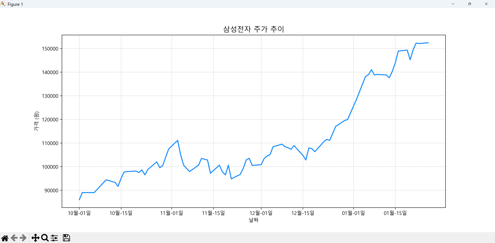
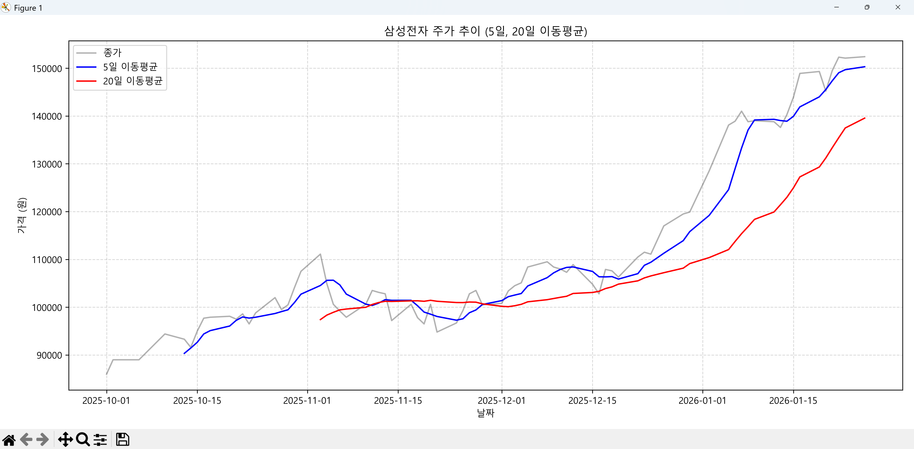

# 평활화(Smoothing)이란?

**평활화(Smoothing)** 란 데이터 분석이나 영상 처리에서 **데이터의 불규칙한 변동(노이즈)을 제거하여 흐름을 부드럽게 만드는 기법** 을 의미합니다.

쉽게 말해, 들쭉날쭉한 그래프나 거친 사진의 입자를 매끄럽게 다듬는 과정이라고 이해하시면 됩니다. 분야별로 그 목적과 방식이 조금씩 다릅니다.

---

## 1. 목적에 따른 구분 종류

1. 통계 및 시계열 분석 (Data Smoothing)
2. 이미지 처리 (Image Smoothing)
3. 자연어 처리 (NLP Smoothing)

### 1. 통계 및 시계열 분석 (Data Smoothing)

주식 차트나 기온 변화처럼 시간에 따라 변하는 데이터에는 '노이즈(무작위 오차)'가 섞여 있기 마련입니다. 평활화를 거치면 전반적인 **추세(Trend)** 를 파악하기 쉬워집니다.

* **이동 평균(Moving Average):** 일정 구간의 데이터 평균을 구해 연결하는 방식입니다. (예: 5일 이동평균선)
* **지수 평활법(Exponential Smoothing):** 최근 데이터에 더 높은 가중치를 두어 계산하는 방식입니다.

### 2. 이미지 처리 (Image Smoothing)

디지털 이미지에서 평활화는 영상의 **노이즈를 줄이거나 이미지를 부드럽게(Blurring)** 만드는 데 사용됩니다. 픽셀 값을 주변 픽셀들의 평균값으로 대체하는 원리입니다.

* **가우시안 블러(Gaussian Blur):** 중심 픽셀에 가까울수록 높은 가중치를 주어 자연스럽게 흐릿하게 만듭니다.
* **평균값 필터(Mean Filter):** 주변 픽셀의 단순 평균을 구해 노이즈를 제거하지만, 사물의 경계선(Edge)까지 뭉개질 수 있다는 단점이 있습니다.

### 3. 자연어 처리 (NLP Smoothing)

언어 모델을 만들 때, 학습 데이터에 한 번도 등장하지 않은 **단어 조합(Sequence)**이 나오면 해당 조건부 확률이 0이 되어버리는 문제가 발생합니다. 이를 방지하기 위해 각 단어의 출현 빈도(Count)에 아주 작은 수(가상 횟수)를 더해준 뒤 전체 확률 분포를 재조정하는 과정을 평활화라고 합니다.

* **라플라스 평활화(Laplace Smoothing):** 빈도수에 1을 더해 확률이 0이 되지 않도록 조정하는 대표적인 기법입니다.

---

## 2. 이동 평균(Moving Average)

**이동 평균(Moving Average, MA)** 이란 시계열 데이터에서 일정 구간의 평균을 구하며 옆으로 이동하는 계산 방식입니다. **"데이터의 뾰족한 변동(노이즈)을 깎아내어 부드러운 흐름을 만드는 작업"** 입니다.

---

### 1. 작동 원리 (Sliding Window)

이동 평균은 이름 그대로 '평균을 구하는 창문(Window)'이 데이터를 따라 한 칸씩 이동하며 계산됩니다. 3일 이동 평균($window=3$)을 예로 들어보겠습니다.

| 날짜 | 데이터 값 | 이동 평균 계산 식 | 결과값 |
| --- | --- | --- | --- |
| 1월 1일 | 10 | (데이터 부족) | `NaN` |
| 1월 2일 | 20 | (데이터 부족) | `NaN` |
| 1월 3일 | 15 |  | **15.0** |
| 1월 4일 | 25 |  | **20.0** |
| 1월 5일 | 30 |  | **23.3** |

* 위 표처럼 **윈도우(구간)** 가 한 칸씩 뒤로 밀리면서 가장 오래된 데이터는 빠지고, 새로운 데이터가 포함되는 방식입니다.

---

### 2. 이동 평균을 사용하는 이유

1. **노이즈 제거 (Noise Reduction):** 하루하루 발생하는 무작위적인 등락을 무시하고 전반적인 방향성을 보여줍니다.
2. **지연 현상 파악 (Lagging Indicator):** 과거 데이터를 바탕으로 하기 때문에 현재의 흐름이 과거에 비해 상승 중인지 하락 중인지 판단하는 기준이 됩니다.
3. **골든크로스/데드크로스:** 주식 차트에서 단기 이동 평균선이 장기 이동 평균선을 뚫고 올라가거나 내려가는 시점을 보고 매수/매도 타이밍을 잡기도 합니다.

---

### 3. 구간(Window) 크기에 따른 차이

* **짧은 구간 (예: 5일 선):** 최근 변화에 민감하게 반응합니다. 그래프가 여전히 조금 뾰족하지만, 추세 변화를 빠르게 포착합니다.
* **긴 구간 (예: 120일 선):** 매우 부드러운 곡선이 됩니다. 사소한 변동은 완전히 사라지고 거대한 흐름(장기 추세)만 남습니다.

---

### 4. 파이썬 Pandas로 확인하기

```python
# window=3은 '3일치씩 묶어서 평균을 내라'는 뜻입니다.
ts.rolling(window=3).mean()

```

### 단순 이동 평균 vs 지수 이동 평균

* **단순 이동 평균 (SMA):** 모든 날짜에 동일한 가중치를 줍니다.
* **지수 이동 평균 (EMA):** "어제 데이터보다 오늘 데이터가 더 중요해!"라고 판단하여, **최근 데이터에 더 높은 가중치**를 줍니다. 그래서 최신 트렌드를 더 잘 반영합니다.

## 3. 주식 차트의 이동 평균 예제

삼성전자 주식 2025-10-01 ~ 2026-01-26 종가 기준으로 cvs 파일 사용하여 5일 이동 평균, 20일 이동평균 출력하는 코드 입니다.

삼성전자(종목코드: 005930)의 해당 기간(2025-10-01 ~ 2026-02-23) 주가 데이터를 다운로드하는 방법은 크게 두 가지가 있습니다. csv 파일로 직접 내려받는 방법과 파이썬 코드를 이용하는 방법입니다.

**Investing.com**과 같은 금융 정보 사이트를 이용하면 편리합니다.

1. [Investing.com 삼성전자 과거 데이터 페이지](https://www.investing.com/equities/samsung-electronics-co-ltd-historical-data)에 접속합니다.
2. **Time Frame** 항목에서 일간(Daily)을 선택합니다.
3. 날짜 선택기에서 시작일을 **2025-10-01**, 종료일을 **2026-01-26**로 설정하고 'Apply'를 누릅니다.
4. 표 우측 상단의 **'Download Data'** 버튼을 클릭하여 CSV 파일(data/samsung_20251001_20260126.csv)로 저장합니다. (로그인이 필요합니다.)
다운 받은 파일의 컬럼명을 변경합니다.

컬럼명 -> "날짜","종가","시가","고가","저가","거래량","변동 %"

1차는 삼성전자 주식 2025-10-01 ~ 2026-01-26 종가 기준으로 차트를 출력하는 예제 파일입니다.

파일 : step3/stock_chart.py

```python
import pandas as pd
import matplotlib.pyplot as plt
import matplotlib.dates as mdates
import locale
# --- 한글 폰트 설정 추가 ---
import platform

# 폰트 설정 (Windows는 'Malgun Gothic', macOS는 'AppleGothic')
if platform.system() == 'Windows':
    plt.rcParams['font.family'] = 'Malgun Gothic'
elif platform.system() == 'Darwin': # macOS
    plt.rcParams['font.family'] = 'AppleGothic'

# 마이너스 기호(-) 깨짐 방지
plt.rcParams['axes.unicode_minus'] = False
# -------------------------

# 2. 날짜 지역 설정 (Locale) 변경
# Windows 환경: "ko_KR" 또는 "Korean"
# macOS/Linux 환경: "ko_KR.UTF-8"
try:
    if platform.system() == 'Windows':
        locale.setlocale(locale.LC_ALL, 'Korean_Korea.949')
    else:
        locale.setlocale(locale.LC_ALL, 'ko_KR.UTF-8')
except locale.Error:
    print("설정하려는 로케일이 시스템에 설치되어 있지 않습니다.")


# 2. CSV 파일 로딩
df = pd.read_csv('./data/samsung_20251001_20260126.csv')

# 2. 날짜 변환 및 인덱스 설정 (컬럼명 확인 필수)
date_col = '날짜'
df[date_col] = pd.to_datetime(df[date_col])
df.set_index(date_col, inplace=True)

# 3. [핵심] 날짜 기준 오름차순 정렬
# 과거 데이터가 위로, 최신 데이터가 아래로 오게 정렬하여 꼬임을 방지합니다.
df = df.sort_index(ascending=True)

# 4. 시각화
plt.figure(figsize=(12, 5))

# 데이터의 첫 번째 열(주가)을 그립니다.
plt.plot(df.index, df.iloc[:, 0], color='dodgerblue', linewidth=2, label="종가")

# 축 포맷 및 레이블
plt.title("삼성전자 주가 추이", fontsize=14)
plt.ylabel("가격 (원)")
plt.xlabel("날짜")
plt.grid(True, linestyle=':', alpha=1)

# X축 날짜 가독성 높이기
plt.gca().xaxis.set_major_formatter(mdates.DateFormatter('%m월-%d일'))

plt.show()

```

실행 결과



---

2차는 삼성전자 주식 2025-10-01 ~ 2026-01-26 종가 기준으로 5, 20일 이동 평균을 출력하는 코드 입니다.

파일 : step3/stock_chart-ma.py

```python
import pandas as pd
import matplotlib.pyplot as plt
import matplotlib.dates as mdates
import locale
# --- 한글 폰트 설정 추가 ---
import platform

# 폰트 설정 (Windows는 'Malgun Gothic', macOS는 'AppleGothic')
if platform.system() == 'Windows':
    plt.rcParams['font.family'] = 'Malgun Gothic'
elif platform.system() == 'Darwin': # macOS
    plt.rcParams['font.family'] = 'AppleGothic'

# 마이너스 기호(-) 깨짐 방지
plt.rcParams['axes.unicode_minus'] = False
# -------------------------

# 2. 날짜 지역 설정 (Locale) 변경
# Windows 환경: "ko_KR" 또는 "Korean"
# macOS/Linux 환경: "ko_KR.UTF-8"
try:
    if platform.system() == 'Windows':
        locale.setlocale(locale.LC_ALL, 'Korean_Korea.949')
    else:
        locale.setlocale(locale.LC_ALL, 'ko_KR.UTF-8')
except locale.Error:
    print("설정하려는 로케일이 시스템에 설치되어 있지 않습니다.")


# 1. 삼성전자 주가 CSV 파일 로딩
file_path = './data/samsung_20251001_20260126.csv'
df = pd.read_csv(file_path)

# 2. 데이터 전처리 (필수 단계)
# 날짜를 datetime 객체로 변환
df['날짜'] = pd.to_datetime(df['날짜'])

# 계산을 위해 날짜를 과거순(오름차순)으로 정렬
df = df.sort_values(by='날짜').reset_index(drop=True)

# 3. 이동평균 계산 (5일, 10일 예시)
df['MA5'] = df['종가'].rolling(window=5).mean()
df['MA20'] = df['종가'].rolling(window=20).mean()

# 4. 결과 시각화
plt.figure(figsize=(12, 6))
plt.plot(df['날짜'], df['종가'], label='종가', color='black', alpha=0.3)
plt.plot(df['날짜'], df['MA5'], label='5일 이동평균', color='blue')
plt.plot(df['날짜'], df['MA20'], label='20일 이동평균', color='red')

plt.title('삼성전자 주가 추이 (5일, 20일 이동평균)')
plt.ylabel("가격 (원)")
plt.xlabel("날짜")
plt.legend()
plt.grid(True, linestyle='--', alpha=0.5)
plt.tight_layout()
plt.show()

# 최종 가공된 데이터 확인
print(df[['날짜', '종가', 'MA5', 'MA20']].tail())

```

실행결과



날짜와 종가, 5, 20일 이동 평균 데이터에서 최종 5건을 출력합니다

```text
           날짜      종가       MA5      MA20
72 2026-01-20  145200  145520.0  131205.0
73 2026-01-21  149500  147360.0  133365.0
74 2026-01-22  152300  149040.0  135455.0
75 2026-01-23  152100  149680.0  137485.0
76 2026-01-26  152400  150300.0  139550.0
```
