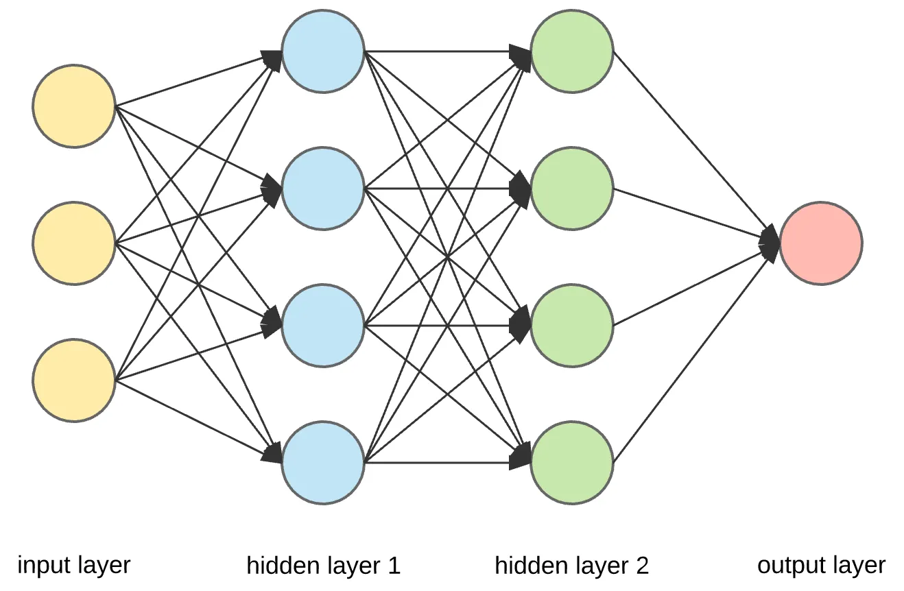

# 딥러닝이란?

통계 모델이 '데이터를 설명하는 수학 공식'이라면, **딥러닝 모델(Deep Learning Model)** 은 '**인간의 뇌 구조를 본떠 스스로 학습하는 거대한 인공 신경망**'이라고 할 수 있습니다.

단순히 공식에 숫자를 대입하는 수준을 넘어, 데이터 속의 아주 복잡하고 미묘한 특징을 컴퓨터가 직접 찾아내는 방식입니다

---

## 1. 딥러닝의 핵심: 인공 신경망 (ANN)

우리 뇌가 **뉴런(Neuron)** 들이 연결되어 신호를 주고받으며 학습하듯, 딥러닝은 **인공 뉴런(Node)** 을 겹겹이 쌓아 올립니다.

* **입력층 (Input Layer):** 데이터를 받아들이는 곳 (예: 사진의 픽셀 정보).
* **은닉층 (Hidden Layers):** 딥러닝의 핵심입니다. 데이터의 특징을 추출하고 복잡한 계산을 수행합니다. 이 층이 깊게(Deep) 쌓여 있어서 '딥'러닝이라고 부릅니다.
* **출력층 (Output Layer):** 최종 결과를 내보내는 곳 (예: "이 사진은 고양이입니다").

---

### 딥러닝 모델(인공신경망) 예시

고양이 이미지가 딥러닝 모델(인공신경망)을 거쳐 어떻게 처리되는지 그 흐름은 아래와 같습니다.

고양이 이미지가 입력층을 통해 들어가고, 여러 은닉층에서 특징(귀 모양, 눈의 형태 등)을 추출한 뒤, 최종적으로 "고양이"라고 판별하는 출력층까지의 과정입니다.

---

### 🔍 단계별 처리 과정 설명

1. **입력층 (Input Layer):**
  * 고양이 사진의 각 픽셀 데이터(RGB 값)가 신경망의 첫 번째 층으로 전달됩니다.
  * 이미지는 컴퓨터가 이해할 수 있는 거대한 숫자 행렬로 변환됩니다.

2. **은닉층 (Hidden Layers - 특징 추출):**
  * **앞부분 은닉층:** 이미지에서 선, 점, 경계선 같은 단순한 형태를 찾아냅니다.
  * **뒷부분 은닉층:** 추출된 선들을 조합하여 귀의 뾰족함, 눈의 둥근 모양, 코의 위치 같은 복잡한 특징(Feature)을 파악합니다.

3. **출력층 (Output Layer):**
  * 모든 특징을 종합하여 최종 판단을 내립니다.
  * "이 이미지는 고양이일 확률 99.8%, 강아지일 확률 0.2%"와 같은 수치를 내놓으며 가장 높은 확률인 **'고양이'** 를 결과로 출력합니다.

---

## 2. 딥러닝 학습 방법

딥러닝 모델의 학습 과정은 마치 아이가 사물을 배우는 과정과 비슷합니다.

1. **순전파 (Forward Propagation):** 데이터를 모델에 넣고 일단 결과를 예측해 봅니다. (처음엔 무작위로 추측합니다)
2. **손실 함수 (Loss Function):** 정답과 모델이 예측한 값의 차이(오차)를 계산합니다.
3. **역전파 (Backpropagation):** 오차를 줄이기 위해 거꾸로 거슬러 올라가며 각 신경망 연결 부위의 '가중치(Weight)'를 조금씩 수정합니다.
4. **반복:** 이 과정을 수백만 번 반복하며 오차가 거의 없는 최적의 상태를 만듭니다.

---

## 3. 통계 모델 vs 딥러닝 모델, 뭐가 다를까?

가장 큰 차이는 **'사람의 개입 정도'** 와 **'데이터의 양'** 입니다.

| 구분 | 통계 모델 (전통적 방식) | 딥러닝 모델 |
| --- | --- | --- |
| **특징 추출** | 사람이 직접 중요한 변수를 골라야 함 | 모델이 스스로 유의미한 특징을 찾아냄 |
| **데이터 양** | 적은 데이터로도 설명 가능 | 엄청나게 많은 데이터가 있어야 성능이 나옴 |
| **복잡도** | 관계가 명확하고 단순할 때 유리 | 이미지, 음성, 텍스트 등 복잡한 데이터에 유리 |
| **해석 가능성** | 결과의 이유를 수학적으로 설명하기 쉬움 | 결과는 정확하지만 내부가 복잡해 설명이 어려움 (Black Box) |

---

## 4. 딥러닝 활용

* **컴퓨터 비전:** 자율주행 자동차가 보행자를 인식하고, 스마트폰 사진첩에서 얼굴별로 사진을 분류합니다.
* **자연어 처리 (NLP):** ChatGPT 같은 챗봇이나 파파고 같은 번역기가 문맥을 이해하고 대화합니다.
* **생성형 AI:** 텍스트를 입력하면 그림을 그려주거나(DALL-E), 음악을 작곡하기도 합니다.

---

## 5. 왜 지금 딥러닝인가요?

사실 인공 신경망 개념은 아주 오래전에 나왔습니다. 하지만 최근에야 꽃을 피운 이유는 두 가지입니다.

1. **빅데이터:** 학습할 수 있는 엄청난 양의 데이터가 쌓였고,
2. **GPU의 발전:** 복잡한 신경망 연산을 빠르게 처리할 수 있는 하드웨어가 뒷받침되었기 때문입니다.

---

딥러닝 모델은 한 마디로 **"데이터가 많을수록 똑똑해지는, 기계의 뇌"** 라고 이해하시면 됩니다.
