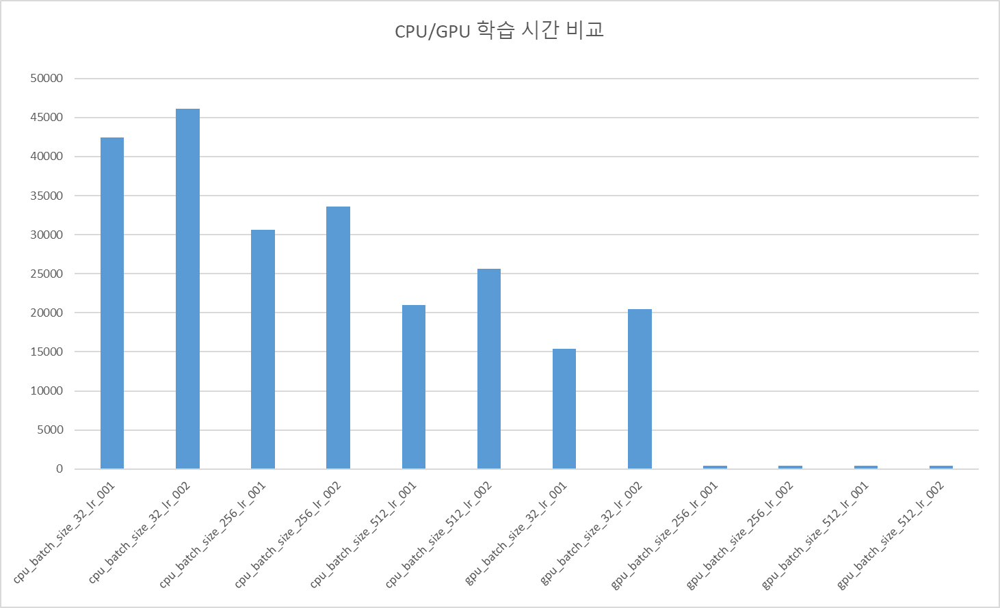

# GPU를 사용 조건 확인

## 1. GPU 가속을 위한 필수 체크리스트

### ① cuDNN 가속 조건

TensorFlow의 LSTM은 NVIDIA의 **cuDNN** 라이브러리를 통해 최적화됩니다. 이를 사용하려면 다음 설정을 지켜야 합니다.

* **활성화 함수:** 반드시 `activation='tanh'`를 사용해야 합니다.
* **재귀 활성화 함수:** `recurrent_activation='sigmoid'` (기본값이므로 따로 건드리지 않으면 통과!)
* **기타:** `recurrent_dropout=0`이어야 합니다. (일반 `Dropout` 레이어는 괜찮지만, LSTM 레이어 내부 옵션인 `recurrent_dropout`을 쓰면 GPU 가속이 안 됩니다.)

### ② 하드웨어 및 라이브러리 설치

* **NVIDIA GPU:** 그래픽 카드가 있어야 합니다.
* **CUDA & cuDNN:** 해당 GPU에 맞는 드라이버와 라이브러리가 설치되어 있어야 합니다.
* **tensorflow-gpu:** 최신 버전(TF 2.x 이상)은 `pip install tensorflow`만 해도 GPU를 자동으로 감지하지만, 환경 설정이 꼬여있으면 CPU만 쓸 수도 있습니다.

---

## 2. 현재 내 코드가 GPU를 쓰는지 확인하는 법

코드 맨 윗부분에 다음 코드를 넣어 실행해 보세요.

```python
import tensorflow as tf
# 사용할 수 있는 GPU 목록 출력
print("사용 가능한 GPU 목록:", tf.config.list_physical_devices('GPU'))

```

만약 `[]` (빈 리스트)가 나온다면 현재 CPU로만 돌아가고 있는 상태입니다.

---

## 3. 학습 속도 개선

**학습 속도 개선** 을 위한 두 가지 핵심이 있습니다.

예를 들면 수학 공부를 한다고 가정을 해보겠습니다.

* 첫번째 방법은 한 번에 넘기는 페이지 수, 또는 읽는 속도(두뇌 성능)를 높여서 학습을 빠르게 하는 방법 입니다.
* 두번째 방법은 수학책을 여러번 반복(예 최소 50번)하여 학습을 완료 방법,입니다.

| 항목 | 비유 | 개선 포인트 |
| --- | --- | --- |
| **Batch Size** | **한 번에 넘기는 페이지 수** | **속도 개선 직접 연관.** 한 번에 많이 처리해서 빨리 넘김. |
| **GPU/CPU 설정** | **읽는 속도(두뇌 성능)** | **속도 개선 직접 연관.** 하드웨어 자원을 쥐어짜서 연산함. |
| **Epoch** | **총 회독 수** | **직접 연관 없음.** 하지만 불필요한 회독을 줄여 전체 시간 단축. |

## 4. **Batch Size**와 **GPU/CPU 설정**으로 속도 향상

학습 속도는 크게 **데이터 공급 속도**와 **연산 처리 속도** 두 지점에서 결정됩니다. 이를 개선하기 위한 4가지 핵심 전략을 알아보겠습니다.

---

### 1. 배치 사이즈(Batch Size) 상향 (가장 효과적)

현재 `batch_size=32`는 고성능 GPU에게는 너무 가벼운 일감입니다. GPU가 연산을 시작하려고 하면 이미 데이터가 끝나버려 노는 시간이 더 많습니다.

* **수정:** `32` → **`256`** 또는 **`512`**
* **효과:** 한 번에 처리하는 데이터 양이 늘어나 GPU의 수천 개 CUDA 코어를 꽉 채워 쓸 수 있습니다. 에포크당 소요 시간이 대폭 줄어듭니다.
* **주의:** 배치 사이즈를 키우면 한 에포크당 가중치 업데이트 횟수(Iteration)가 줄어드므로, 학습률(`lr`)을 조금 높여주는 것이 좋습니다.

|cpu/gpu|batch_size|학습률|에포크당|평균시간(ms)|
|---|--|--|--|---|
|cpu|32|0.001|50|42466|
|cpu|32|0.002|50|46070|
|cpu|256|0.001|50|30581|
|cpu|245|0.002|50|33613|
|cpu|512|0.001|50|20989|
|cpu|512|0.002|50|25632|
|gpu|32|0.001|50|15425|
|gpu|32|0.002|50|20430|
|gpu|256|0.001|50|437|
|gpu|245|0.002|50|438|
|gpu|512|0.001|50|454|
|gpu|512|0.002|50|453|



### 2. 혼합 정밀도(Mixed Precision) 사용

GPU는 **Tensor Core**라는 딥러닝 전용 가속기가 있습니다. 기본 32비트 연산을 16비트로 낮춰 연산하면 속도는 2배 빨라지고 메모리 사용량은 절반으로 줄어듭니다.

```python
from tensorflow.keras import mixed_precision

# 혼합 정밀도 정책 설정
policy = mixed_precision.Policy('mixed_float16')
mixed_precision.set_global_policy(policy)

# 이후 모델 설계 시 출력층(Dense)의 dtype은 'float32'로 고정해야 함
# Dense(1, dtype='float32')

```

### 4. GPU 하드웨어 가속 최적화 (XLA 컴파일) (step6 폴더 참조)

XLA(Accelerated Linear Algebra)는 모델의 연산 그래프를 분석하여 GPU에 최적화된 형태로 '통합'해주는 컴파일러입니다.

* **설정:** `model.compile` 시 옵션을 추가합니다.

파일명 : main_tensorflow4.py

```python
model.compile(optimizer='adam', loss='mse', jit_compile=True)

```

jit_compile적용.txt 파일의 결과는 gpu_batch_size_256_lr_001_f16.txt 파일을 비교해보면 앞쪽부분의 학습시간이 약간 줄어드는 것을 확인할 수 있다.
실제 작업에서는 더 큰 데이터로 하면 좋은 처리결과를 확인할 수 있습니다

---
