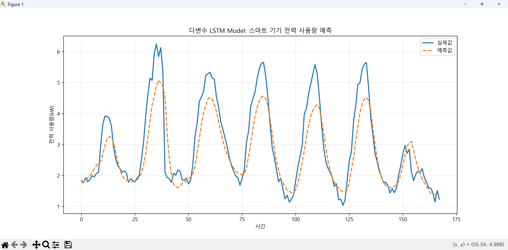
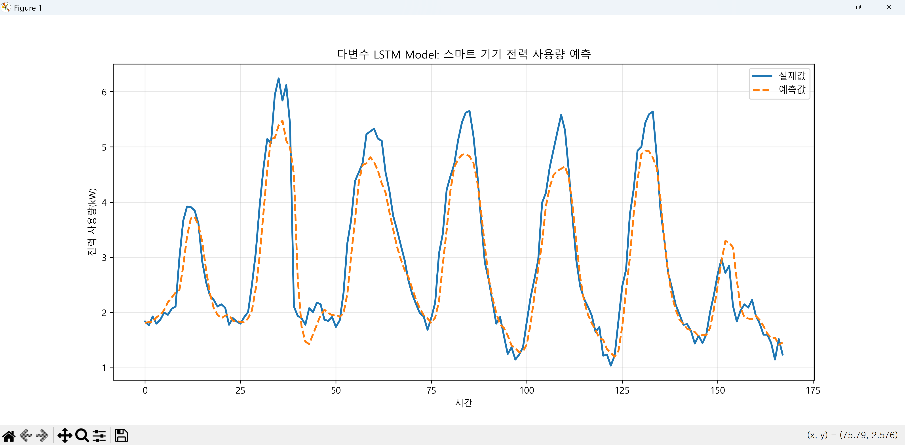
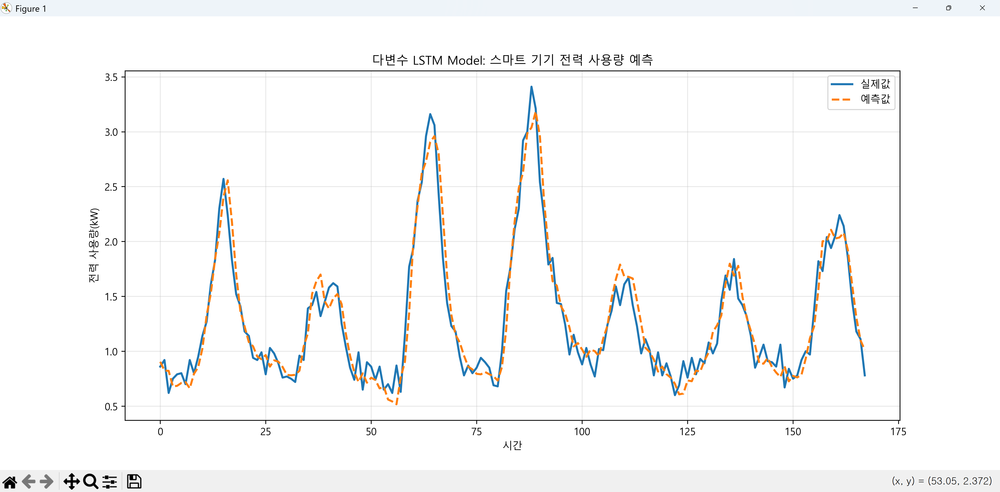

# 다변량 LSTM 모델

다변량 LSTM(Multivariate Long Short-Term Memory)은 시계열 데이터 분석에서 **여러 개의 독립 변수(입력 특성)를 동시에 고려하여 종속 변수를 예측**하는 딥러닝 모델입니다.

일반적인 LSTM이 하나의 변수(예: 과거 주가)만으로 미래를 예측한다면, 다변량 LSTM은 여러 상관관계가 있는 변수들을 엮어 복합적인 패턴을 학습합니다.

---

## 1. 다변량 LSTM 모델 설계

### 1. 다변량 LSTM의 개념

LSTM은 기본적으로 RNN(순환 신경망)의 '장기 의존성 삭제' 문제를 해결한 모델입니다. **다변량(Multivariate)** 모델은 LSTM이 갖는 기술적 특징과 데이터 처리 방식에 **차원(Dimension)** 의 개념을 더한 것입니다.

* **입력($X$):**  시점에서의 입력이 단일 값이 아닌 벡터($x_1, x_2, ..., x_n$) 형태입니다.
* **특징:** 변수 간의 상호작용을 학습합니다. 예를 들어, 기온뿐만 아니라 습도와 풍속이 어떻게 서로 영향을 주어 강수량을 결정하는지를 파악합니다.

---

### 2. 모델 구조

다변량 LSTM의 핵심 구조는 각 시점($t$)에서 여러 피처가 들어와도 이를 효과적으로 처리할 수 있도록 설계된 **Gate(게이트)** 시스템에 있습니다.

#### 내부 메커니즘

1. **입력 단계:** 여러 개의 시계열 변수가 병렬로 입력됩니다. 데이터의 형태는 보통 `[Samples, Time Steps, Features]`입니다.
2. **Forget Gate (망각 게이트):** 과거 정보 중 어떤 것을 버릴지 결정합니다.
3. **Input Gate (입력 게이트):** 현재 시점의 다변량 데이터 중 어떤 새로운 정보를 셀 상태에 저장할지 결정합니다.
4. **Cell State (셀 상태):** 핵심 정보가 관통하는 통로로, 다변량 간의 복잡한 관계를 장기적으로 유지합니다.
5. **Output Gate (출력 게이트):** 가공된 정보를 바탕으로 최종 예측값을 출력합니다.

---

### 3. 언제 사용하는가? (활용 예시)

단일 변수만으로는 설명이 부족한 **복합적인 시스템**을 예측할 때 사용합니다.

#### ① 주식 및 금융 시장 예측

* **입력 변수:** 과거 주가, 거래량, 금리, 환율, 원자재 가격
* **이유:** 주가는 단순히 과거 주가뿐만 아니라 거시 경제 지표에 민감하게 반응하기 때문입니다.

#### ② 기상 및 미세먼지 예측

* **입력 변수:** 온도, 습도, 대기압, 풍향, 인근 지역의 오염 농도
* **이유:** 미세먼지 농도는 바람의 방향이나 습도 등 다양한 기상 요인과 복합적으로 얽혀 있습니다.

#### ③ 스마트 팩토리 설비 이상 탐지

* **입력 변수:** 진동, 소음, 전류, 전압, 온도
* **이유:** 특정 부품의 고장은 하나의 지표가 아닌 여러 센서의 미세한 동시 변화로 나타나는 경우가 많습니다.

---

### 4. 다변량 LSTM 구현 시 주의사항

* **데이터 스케일링:** 변수마다 단위(예: 온도는 20도, 전압은 220V)가 다르므로 **Min-Max Scaling**이나 **Standardization**이 필수입니다.
* **시차(Lag) 설정:** 어떤 변수가 예측 대상에 영향을 주기까지 걸리는 시간(Time Lag)을 고려하여 윈도우 사이즈를 설정해야 합니다.
* **과적합(Overfitting):** 변수가 많아질수록 모델이 복잡해져 학습 데이터에만 과하게 최적화될 수 있습니다. Dropout이나 규제 기법을 함께 사용해야 합니다.

---

## 2. 다변량 LSTM 모델 구현 (day4/step1 폴더 참조)

스마트 기기 전력 사용량 데이터를 활용한 다변량 LSTM 모델 구축을 위해, **[분석 및 설계 절차]** 와 실제 실행해야 할 **[작업 단계]** 을 알아보겠습니다.

---

### 1. 다변량 LSTM 구축 로드맵 (설계 + 실행)

전체 과정은 **데이터 이해 → 가공 → 변환 → 학습 → 검증**의 흐름을 따릅니다.

#### **1단계: 데이터 탐색 및 요구사항 정의 (EDA(Exploratory Data Analysis))**

* **설계 전략:** 데이터의 특성을 파악하여 예측에 방해가 되는 요소를 제거합니다.
* **실행 내용:**
  * `Date`, `Temperature`, `Usage` 필드의 결측치(NaN) 확인.
  * 시간에 따른 사용량 그래프를 그려보며 **주기성(Daily/Weekly)** 이 있는지 확인합니다.
  * 스마트 기기 특성상 사용량이 0인 구간(꺼짐)이나 갑작스러운 피크(에어컨 가동 등)를 체크합니다.

> 결측치 처리 예제 : day3/step4/clean_data.py 참조하세요

#### **2단계: 특성 공학 (Feature Engineering)**

* **설계 전략:** 모델이 "시간의 흐름"과 "기온의 영향"을 동시에 이해하도록 특성를 확장합니다.
* **실행 내용:**
  * **Cyclical Encoding:** 시간 데이터(0~23)를 $sin$과 $cos$값으로 변환합니다. 이는 23시와 0시가 수치적으로 멀지만 시간상으로는 인접함을 모델에 알려주는 **특별한 처리**입니다.
  * **다변량 결합:** 온도와 전력량, 그리고 인코딩된 시간 변수를 하나의 데이터 테이블로 결합합니다.

#### **3단계: 데이터 전처리 (Preprocessing)**

* **설계 전략:** 신경망 학습에 최적화된 수치 범위와 3차원 입력을 준비합니다.
* **실행 내용:**
  * **Scaling:** `MinMaxScaler`를 사용해 모든 데이터를 0~1 사이로 맞춥니다.
  * **Sliding Window:** 과거 24시간($t-24 \sim t-1$)을 보고 현재($t$)를 예측하도록 3차원 배열(`[samples, time_steps, features]`)을 생성합니다.

#### **4단계: 모델 설계 및 학습 (Modeling)**

* **설계 전략:** 다변량 LSTM 층을 사용하여 효율적인 비선형 패턴 추출을 진행합니다.
* **실행 내용:**
  * **Input Layer:** 24시간의 타임스텝과 4개의 피처를 받는 입력층.
  * **LSTM Layer:** 50~64개의 유닛을 가진 단일 층 구성.
  * **Dropout:** 학습 데이터에만 과하게 익숙해지는 과적합(Overfitting)을 방지하기 위해 20%의 노드를 무작위로 제외합니다.
  * **Dense Layer:** 최종적으로 1개의 전력 사용량 값을 출력합니다.

#### **5단계: 평가 및 예측 (Evaluation)**

* **설계 전략:** 보지 못한 데이터(Test Set)를 통해 모델의 실전 성능을 측정합니다.
* **실행 내용:**
  * 테스트 데이터로 예측을 수행하고, 실제 사용량 그래프와 겹쳐서 비교합니다.
  * MSE(Mean Squared Error) 등의 지표로 오차를 수치화합니다.

---

파일명 : day4/step1/main.py

### 최종 통합 코드 (Python)

위의 모든 절차를 구현한 코드입니다.

```python
import pandas as pd
import numpy as np
import koreanize_matplotlib
import matplotlib.pyplot as plt
from sklearn.preprocessing import MinMaxScaler
import tensorflow as tf
from tensorflow.keras.models import Sequential
from tensorflow.keras.layers import Input, LSTM, Dense, Dropout
from tensorflow.keras.callbacks import EarlyStopping

# 1. 시각화 및 환경 설정
plt.rcParams['axes.unicode_minus'] = False 

# [단계 1] 데이터 로드 및 시간 변환
df = pd.read_csv('./data/power_usage_dataset.csv')
df['Date'] = pd.to_datetime(df['Date'])

# [단계 2] 특성 공학 (Cycle Encoding)
# 23시와 0시가 연속적임을 모델에게 알려주는 중요한 과정입니다.
df['hour'] = df['Date'].dt.hour
df['hour_sin'] = np.sin(2 * np.pi * df['hour'] / 23)
df['hour_cos'] = np.cos(2 * np.pi * df['hour'] / 23)

features_list = ['Temperature', 'Usage', 'hour_sin', 'hour_cos']
data = df[features_list].values

# [단계 3] 데이터 전처리 (스케일링 및 시퀀스 생성)
scaler = MinMaxScaler()
scaled_data = scaler.fit_transform(data)

def create_sequences(data, window_size=24):
    X, y = [], []
    for i in range(len(data) - window_size):
        X.append(data[i:i + window_size, :]) 
        y.append(data[i + window_size, 1]) # Target: Usage
    return np.array(X), np.array(y)

window_size = 24 # 1주일(24시간) 패턴 학습
X, y = create_sequences(scaled_data, window_size)

# 데이터 분할
split = int(len(X) * 0.8)
X_train, X_test = X[:split], X[split:]
y_train, y_test = y[:split], y[split:]

print(f"✅ 학습 데이터 규격: {X_train.shape} (샘플 수, 타임스텝, 피처 수)")

# [단계 4] 모델 설계 (최신 권장 스타일: Input 레이어 및 Stacked 구조)
model = Sequential([
    Input(shape=(window_size, 4)), # 입력 규격 명시
#    Input(shape=(X_train.shape[1], X_train.shape[2])), # X_train 변수를 활용한 규격 명시 (24, 4)로 변경
    LSTM(units=128, activation='tanh'),
    Dense(32, activation='tanh'),
    Dense(units=1)
])

# [단계 5] 컴파일 및 조기 종료 설정
model.compile(optimizer='adam', loss='mse')

early_stop = EarlyStopping(
    monitor='val_loss',         # 감시 대상: 검증 데이터의 손실 값
    patience=7,                 # 성능 개선이 없을 때 기다려줄 에포크 횟수
    restore_best_weights=True   # 학습 종료 후 가장 성적이 좋았던 시점의 가중치로 복원
)

# 모델 학습
history = model.fit(
    X_train, y_train,
    epochs=50,
    batch_size=32,
    validation_split=0.1,
    callbacks=[early_stop], #조기 종료 콜백 추가
    verbose=1
)

# [단계 6] 예측 및 역스케일링
predictions_scaled = model.predict(X_test)

def get_original_units(scaled_values, scaler, feature_count, target_idx=1):
    dummy = np.zeros((len(scaled_values), feature_count))
    dummy[:, target_idx] = scaled_values.flatten()
    return scaler.inverse_transform(dummy)[:, target_idx]

y_test_original = get_original_units(y_test, scaler, len(features_list))
predictions_original = get_original_units(predictions_scaled, scaler, len(features_list))

# [단계 7] 결과 시각화
plt.figure(figsize=(14, 6))
plt.plot(y_test_original[:168], label='실제값', color='#1f77b4', alpha=0.8, linewidth=2)
plt.plot(predictions_original[:168], label='예측값', color='#ff7f0e', linestyle='--', linewidth=2)
plt.title('다변량 LSTM: 전력 사용량 예측')
plt.xlabel('시간')
plt.ylabel('전력 사용량(kW)')
plt.legend()
plt.grid(True, alpha=0.3)
plt.show()

```

---

### 실행 결과



---

### 핵심 포인트

* **설계의 핵심:** 단순히 숫자를 넣는 것이 아니라, `sin/cos` 변환과 같은 **도메인 지식 기반의 특성 추출** 이 모델의 지능을 결정합니다.
* **구조의 단순화:** 다변량 LSTM을 사용하여 연산 부하를 줄이고 과적합을 방지했습니다.
* **데이터의 연결:** `create_sequences` 함수가 바로 설계 전략(과거를 통해 미래를 본다)을 물리적으로 구현하는 핵심 장치입니다.

---

## 3. 다변량 LSTM 모델 구현 시 특성 추가 (day4/step1 폴더 참조 main2.py)

평일과 주말은 스마트 기기 사용 패턴(예: 가전제품 가동 시간, 재택 여부 등)에 결정적인 차이를 만듭니다. 이를 모델에 알려주기 위해 **주말 여부를 0(평일)과 1(주말)** 로 표시하는 바이너리 특성을 추가하는 방법을 알아 보겠습니다.

---

### 1. 특성 공학 (Feature Engineering) 추가

* **Is_Weekend 피처 생성:** `Date` 필드에서 요일을 추출하여 토요일(5)과 일요일(6)인 경우를 1로, 나머지는 0으로 설정합니다.
* **다변량 결합:** 이제 모델은 [온도, 전력량, 시간_sin, 시간_cos, **주말여부**] 총 5개의 변수를 동시에 학습합니다.

### 2. 데이터 전처리

* **스케일링:** 주말 여부(0 또는 1)도 스케일러에 포함시켜 모델이 다른 변수들과 동일한 선상에서 처리하도록 합니다.
* **윈도우 구조:** 입력 피처가 4개에서 **5개**로 늘어남에 따라 `input_shape`가 자동으로 조정됩니다.

---

파일명 : day4/step1/main2.py

## 💻 최종 통합 코드 (평일/주말 구분 포함)

```python
import pandas as pd
import numpy as np
import koreanize_matplotlib
import matplotlib.pyplot as plt
from sklearn.preprocessing import MinMaxScaler
import tensorflow as tf
from tensorflow.keras.models import Sequential
from tensorflow.keras.layers import Input, LSTM, Dense, Dropout
from tensorflow.keras.callbacks import EarlyStopping

# 1. 환경 설정
plt.rcParams['axes.unicode_minus'] = False 

# [단계 1] 데이터 로드
df = pd.read_csv('./data/power_usage_dataset.csv')
df['Date'] = pd.to_datetime(df['Date'])

# [단계 2] 특성 공학 (Feature Engineering)
# (1) 시간 주기성 변환
df['hour'] = df['Date'].dt.hour
df['hour_sin'] = np.sin(2 * np.pi * df['hour'] / 23)
df['hour_cos'] = np.cos(2 * np.pi * df['hour'] / 23)

# (2) 주말 변수 추가 (토/일은 1, 평일은 0)
df['is_weekend'] = df['Date'].dt.weekday.map(lambda x: 1 if x >= 5 else 0)

# 사용할 특성 리스트 (총 5개)
features_list = ['Temperature', 'Usage', 'hour_sin', 'hour_cos', 'is_weekend']
data = df[features_list].values

# [단계 3] 데이터 전처리
scaler = MinMaxScaler()
scaled_data = scaler.fit_transform(data)

def create_sequences(data, window_size=24):
    X, y = [], []
    for i in range(len(data) - window_size):
        X.append(data[i:i + window_size, :]) 
        y.append(data[i + window_size, 1]) # Target: Usage
    return np.array(X), np.array(y)

window_size = 24 # 과거 24시간 패턴 학습
X, y = create_sequences(scaled_data, window_size)

# 데이터 분할 (순서 유지)
split = int(len(X) * 0.8)
X_train, X_test = X[:split], X[split:]
y_train, y_test = y[:split], y[split:]

# [단계 4] 최신 스타일 모델 설계 (Stacked LSTM)
model = Sequential([
    Input(shape=(X_train.shape[1], X_train.shape[2])), # (24, 5) 규격 명시
    LSTM(128, activation='tanh'),
    Dense(32, activation='tanh'),
    Dense(1)
])

# [단계 5] 컴파일 
model.compile(optimizer='adam', loss='mse')

# 조기 종료 설정
early_stop = EarlyStopping(
    monitor='val_loss', 
    patience=7, 
    restore_best_weights=True
)

# 모델 학습
history = model.fit(
    X_train, y_train,
    epochs=50,
    batch_size=32,
    validation_split=0.1,
    callbacks=[early_stop],
    verbose=1
)

# [단계 6] 예측 및 역스케일링
predictions_scaled = model.predict(X_test)

def get_original_units(scaled_values, scaler, feature_count, target_idx=1):
    """5개 변수 구조를 유지하며 Target(전력량)만 역변환"""
    dummy = np.zeros((len(scaled_values), feature_count))
    dummy[:, target_idx] = scaled_values.flatten()
    return scaler.inverse_transform(dummy)[:, target_idx]

y_test_original = get_original_units(y_test, scaler, len(features_list))
predictions_original = get_original_units(predictions_scaled, scaler, len(features_list))

# [단계 7] 결과 시각화
plt.figure(figsize=(14, 6))
plt.plot(y_test_original[:168], label='실제값', color='#1f77b4', linewidth=2)
plt.plot(predictions_original[:168], label='예측값', color='#ff7f0e', linestyle='--', linewidth=2)
plt.title('다변량 LSTM (Weekend Feature): 스마트 기기 전력 사용량 예측')
plt.xlabel('시간 (1주일치)')
plt.ylabel('전력 사용량(kW)')
plt.legend()
plt.grid(True, alpha=0.3)
plt.show()

```

---

### 실행 결과 (결과 이미지 비교)



---


## 4. 분석 후 추가 작업 (day4/step1 폴더 참조 main3.py)

평일/주말 피처를 추가했음에도 불구하고 결과가 오히려 안 좋게 나오는 현상은 시계열 예측 모델링에서 흔히 발생하는 문제입니다.

---

### 1. 왜 주말 피처를 넣었는데 결과가 더 안 좋을까?

#### **원인 1: 데이터의 부족 (Data Scarcity)**

LSTM은 패턴을 학습하는 모델입니다. 전체 데이터 중 평일은 5/7(약 71%)을 차지하지만, 주말은 2/7(약 28%)뿐입니다. 모델 입장에서는 주말 패턴을 충분히 학습할 데이터 양이 부족한 상태에서 새로운 변수가 들어오니 오히려 **노이즈** 로 받아들일 수 있습니다.

#### **원인 2: "주말"이라는 신호의 단순함 (Binary Feature의 한계)**

단순히 0과 1로만 구분하면 모델은 "주말엔 무조건 높다/낮다" 식의 단순한 오프셋(Offset)만 학습하려고 할 수 있습니다. 하지만 실제로는 주말 안에서도 토요일과 일요일의 패턴이 다를 수 있고, 기온과의 상호작용이 평일과 다르게 복잡할 수 있습니다.

#### **원인 3: 피처 간의 불균형 (Feature Scaling)**

`is_weekend`는 0과 1로 명확히 나뉘는 반면, 온도나 사용량은 연속적인 값입니다. 모델이 학습 과정에서 이 갑작스러운 0/1 신호를 어떻게 처리해야 할지 혼란을 겪으며 최적의 가중치를 찾는 데 방해를 받을 수 있습니다.

---

### 2. 두 번째 결과(주말 포함)를 개선하는 방법

결과를 개선하기 위해 시도해 볼 수 있는 **특별한 처리** 전략들입니다.

#### **방법 1: 윈도우 크기(Window Size) 확장**

현재 24시간(하루) 패턴만 보고 있습니다. 하지만 주말 패턴을 이해하려면 **최소 일주일(168시간)** 정도의 흐름을 모델이 한 번에 볼 수 있어야 합니다.

* **수정 사항:** `window_size = 24` → `window_size = 168` (데이터 양이 충분할 경우)

#### **방법 2: 요일별 임베딩 또는 세분화**

0/1이 아니라 0(월) ~ 6(일)까지의 요일 정보를 넣고, 이를 다시 Sin/Cos으로 변환하여 요일 간의 연속성을 부여합니다.

* **효과:** 금요일 밤과 토요일 아침의 연결성을 모델이 더 잘 이해하게 됩니다.

#### **방법 3: 가중치 부여 (Sample Weighting)**

데이터 수가 적은 주말 데이터에 대해 **Loss(손실 함수) 가중치**를 더 높게 설정하여, 모델이 주말 데이터를 틀렸을 때 더 큰 벌칙을 받게 합니다.

#### **방법 4: 상호작용 피처(Interaction Feature) 생성**

온도가 사용량에 미치는 영향이 평일과 주말에 다를 수 있습니다.

* **예:** `Temp_Weekend = Temperature * is_weekend` 라는 피처를 추가하여 주말 특화 온도 반응을 학습시킵니다.

---

### 3. 개선된 코드 (요일 주기성 추가)

단순 0/1 보다는 **요일 주기성**을 추가하는 것이 일반적으로 성능이 더 좋습니다.

아래 예제에서 사용하는 데이터는 **3개월 측정 데이터** 를 사용하여 진행합니다.

파일명 : day4/step1/main3.py

```python
# 기존 is_weekend 대신 요일 주기성(Sin/Cos) 적용 예시
df['weekday'] = df['Date'].dt.weekday
df['weekday_sin'] = np.sin(2 * np.pi * df['weekday'] / 6)
df['weekday_cos'] = np.cos(2 * np.pi * df['weekday'] / 6)

# 피처 리스트 업데이트
features_list = ['Temperature', 'Usage', 'hour_sin', 'hour_cos', 'weekday_sin', 'weekday_cos']

```

---

### 실행 결과


