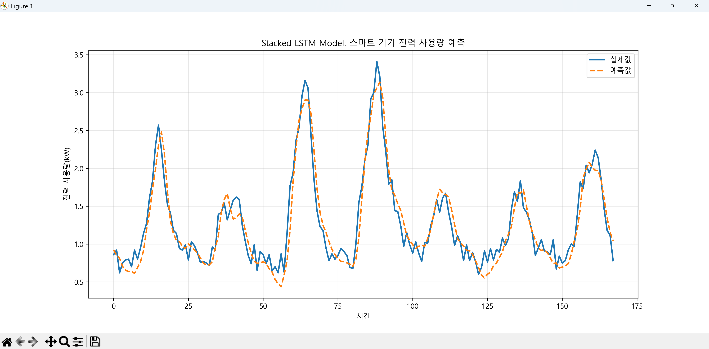
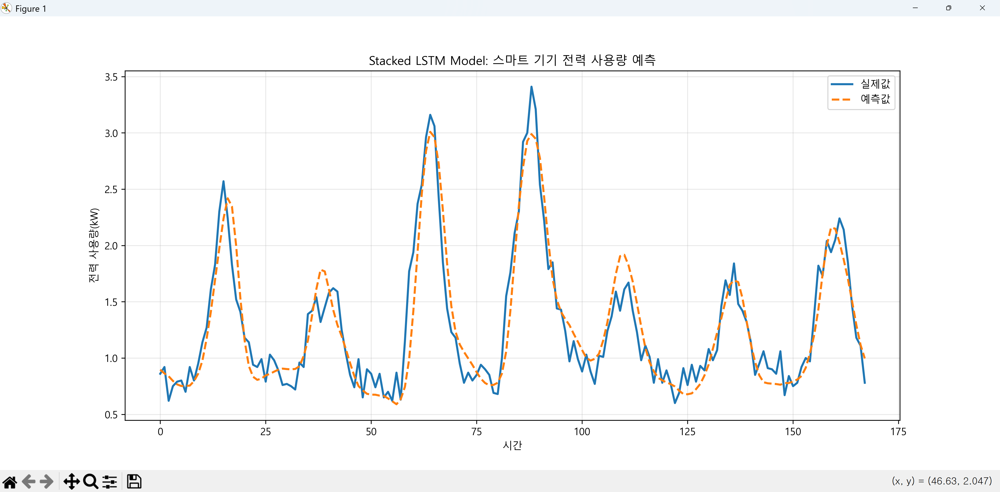
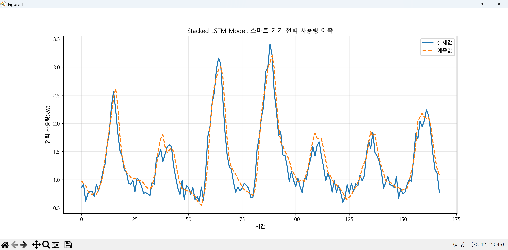

# Stacked LSTM 모델 이란?

Stacked LSTM(중첩 LSTM)은 여러 개의 LSTM 계층을 수직으로 쌓아 올린 구조를 말합니다. 쉽게 말해, 첫 번째 LSTM의 출력이 단순한 최종 결과값이 아니라 **다음 LSTM 계층의 입력값**이 되는 방식입니다.

단일 LSTM이 시계열 데이터의 선형적인 흐름을 파악한다면, Stacked LSTM은 데이터 속에 숨겨진 **더 복잡하고 추상적인 패턴**을 계층적으로 학습하기 위해 사용됩니다.

---

## 1. Stacked LSTM 모델 개념

### 1. Stacked LSTM의 구조와 작동 원리

일반적인 LSTM은 시퀀스 데이터를 입력받아 하나의 은닉 상태(Hidden State)를 출력하지만, Stacked LSTM은 층을 쌓음으로써 '깊은(Deep)' 모델을 형성합니다.

* **하위 계층 (Lower Layers):** 입력 데이터와 직접 맞닿아 있으며, 원시 데이터에서 기초적인 특징(예: 주가 데이터의 단기 변동성)을 추출합니다.
* **상위 계층 (Higher Layers):** 하위 계층에서 넘어온 특징들을 재조합하여 더 고차원적인 정보(예: 장기적인 추세나 복잡한 계절성 패턴)를 학습합니다.

#### 핵심 포인트: `return_sequences=True`

Stacked LSTM을 구현할 때 가장 중요한 테크닉은 중간 계층의 LSTM들이 **시퀀스 전체**를 출력하도록 설정하는 것입니다. 그래야 다음 층의 LSTM이 시간 순서대로 데이터를 전달받을 수 있기 때문입니다.

---

### 2. 왜 층을 쌓는가? (장점)

1. **계층적 특징 학습:** 딥러닝의 핵심인 '추상화'가 가능해집니다. 복잡한 시계열 데이터일수록 단일 층보다는 다층 구조가 훨씬 정교하게 예측을 수행합니다.
2. **비선형성 증가:** 각 층을 통과할 때마다 활성화 함수를 거치면서 모델이 데이터의 복잡한 비선형 관계를 더 잘 표현하게 됩니다.

---

### 3. 주의할 점과 한계

* **과적합(Overfitting) 위험:** 모델이 너무 깊어지면 학습 데이터에만 지나치게 최적화될 수 있습니다. 이를 방지하기 위해 **Dropout**이나 **L2 규제**를 함께 사용하는 것이 일반적입니다.
* **연산 비용:** 층이 깊어질수록 파라미터 수가 급격히 늘어나 학습 시간이 오래 걸리고 메모리 점유율이 높아집니다.
* **기울기 소실/폭주:** LSTM 자체가 기울기 소실 문제에 강하지만, 층이 너무 깊어지면 여전히 학습이 불안정해질 수 있습니다.

---

### 4. 활용 사례

Stacked LSTM은 주로 고차원적인 맥락 파악이 필요한 분야에서 활약합니다.

* **복잡한 주가 및 환율 예측**
* **자연어 처리 (기계 번역, 챗봇)**
* **정교한 날씨 및 에너지 수요 예측**

---

Stacked LSTM은 단순히 "많이 쌓는다고 좋은 것"은 아니며, 데이터의 크기와 복잡도에 맞춰 적절한 층수(보통 2~3층에서 시작)를 결정하는 것이 실력의 핵심입니다.

---

## 2. Stacked LSTM 모델을 구축하고 적용 과정

Stacked LSTM 모델을 구축하고 적용하는 과정은 데이터의 차원을 관리하는 것이 핵심입니다. 일반적인 머신러닝 절차와 유사하지만, **'시퀀스 출력'** 을 다루는 부분이 가장 중요합니다.

---

### 1단계: 데이터 준비 및 시퀀스 생성

LSTM은 3차원 배열인 **(샘플 수, 타임스텝, 특성 수)** 형태의 입력을 요구합니다.

* **슬라이딩 윈도우:** 과거 데이터(예: 168시간)를 하나의 묶음으로 만들어 입력($X$)을 생성합니다.
* **스케일링:** LSTM은 활성화 함수로 `tanh`를 주로 사용하므로, 데이터 범위를 **0과 1 사이(Min-Max Scaling)** 로 맞추는 것이 필수입니다.

### 2단계: 첫 번째 LSTM 계층 설정 (중간 전달자)

Stacked LSTM의 첫 번째 층은 반드시 다음 층으로 시계열 정보를 넘겨줘야 합니다.

* **핵심 설정:** `return_sequences=True`
* 이 옵션을 켜야만 $(168, 64)$와 같이 각 타임스텝별 출력값이 유지되어 다음 LSTM 층이 "시간의 흐름"을 다시 학습할 수 있습니다.

### 3단계: 중간/마지막 LSTM 계층 설정

* **중간 층:** 만약 3층 이상 쌓는다면, 마지막 층을 제외한 모든 LSTM 층은 `return_sequences=True`를 유지해야 합니다.
* **마지막 층:** 마지막 LSTM 층은 `return_sequences=False`(기본값)로 설정합니다. 이는 시퀀스 데이터를 하나의 요약된 벡터로 변환하여 밀집층(Dense Layer)에 전달하기 위함입니다.

### 4단계: 모델 컴파일 및 학습

* **손실 함수:** 전력량 예측과 같은 회귀 문제에서는 보통 `MSE(평균 제곱 오차)`를 사용합니다.
* **옵티마이저:** 일반적으로 `Adam`이 가장 안정적인 성능을 보입니다.
* **조기 종료(EarlyStopping):** 층이 깊어질수록 과적합 확률이 높으므로, 검증 손실(val_loss)이 더 이상 줄어들지 않으면 학습을 멈추도록 설정합니다.

### 5단계: 예측 및 역스케일링 (Post-processing)

* 모델의 출력값은 0~1 사이의 스케일링된 값입니다.
* 이를 실제 전력량 단위(kW)로 확인하기 위해 **`inverse_transform`** 과정을 거쳐 시각화합니다.

---

#### 요약: Stacked LSTM 설계 체크리스트

| 단계 | 주요 작업 | 주의 사항 |
| --- | --- | --- |
| **Data** | 3D Tensor 생성 | `(Samples, Timesteps, Features)` |
| **Layer 1** | 첫 번째 LSTM | `return_sequences=True` 설정 필수 |
| **Layer 2** | 마지막 LSTM | `return_sequences=False` (Dense 연결용) |
| **Output** | Dense Layer | 출력 뉴런 수를 예측 타겟 수와 일치 |

---

## 3. Stacked LSTM 기반 스마트 전력량 예측 코드(day4/step2 폴더 참조)

파일명 : day4/step2/main.py

```python
import pandas as pd
import numpy as np
import koreanize_matplotlib
import matplotlib.pyplot as plt
from sklearn.preprocessing import MinMaxScaler
import tensorflow as tf
from tensorflow.keras.models import Sequential
from tensorflow.keras.layers import Input, LSTM, Dense, Dropout
from tensorflow.keras.regularizers import l2
from tensorflow.keras.callbacks import EarlyStopping

# 1. GPU 메모리 동적 할당 (RTX 30 시리즈 등 최신 환경 필수)
gpus = tf.config.list_physical_devices('GPU')
if gpus:
    try:
        for gpu in gpus:
            tf.config.experimental.set_memory_growth(gpu, True)
    except RuntimeError as e:
        print(f"GPU 설정 오류: {e}")

# 시각화 설정
plt.rcParams['axes.unicode_minus'] = False 

# [단계 1 & 2] 데이터 로드 및 특성 공학 (Cycle Encoding)
df = pd.read_csv('./data/power_usage_dataset_3month.csv')
df['Date'] = pd.to_datetime(df['Date'])

# 시간(0~23) 및 요일(0~6) 주기성 반영
df['hour'] = df['Date'].dt.hour
df['hour_sin'] = np.sin(2 * np.pi * df['hour'] / 23)
df['hour_cos'] = np.cos(2 * np.pi * df['hour'] / 23)

df['weekday'] = df['Date'].dt.weekday
df['weekday_sin'] = np.sin(2 * np.pi * df['weekday'] / 6)
df['weekday_cos'] = np.cos(2 * np.pi * df['weekday'] / 6)

features_list = ['Temperature', 'Usage', 'hour_sin', 'hour_cos', 'weekday_sin', 'weekday_cos']
data = df[features_list].values

# [단계 3] 데이터 전처리
scaler = MinMaxScaler()
scaled_data = scaler.fit_transform(data)

def create_sequences(data, window_size=168):
    X, y = [], []
    for i in range(len(data) - window_size):
        X.append(data[i:i + window_size, :]) 
        y.append(data[i + window_size, 1]) # Target: Usage
    return np.array(X), np.array(y)

window_size = 168 
X, y = create_sequences(scaled_data, window_size)

# 데이터 분할 (8:2)
split = int(len(X) * 0.8)
X_train, X_test = X[:split], X[split:]
y_train, y_test = y[:split], y[split:]

print(f"✅ 학습 데이터 규격: {X_train.shape} (샘플 수, 타임스텝, 피처 수)")

# [단계 4] Stacked LSTM 모델 설계
model = Sequential([
    # (1) 입력 전용 레이어: 데이터의 '문지기' 역할
    Input(shape=(X_train.shape[1], X_train.shape[2])),
    
    # (2) 첫 번째 LSTM: return_sequences=True로 설정하여 시퀀스 전체를 다음 층으로 전달
    # 과적합 방지를 위해 L2 규제와 Dropout 추가
    LSTM(64, activation='tanh', return_sequences=True, kernel_regularizer=l2(0.0001)),
    Dropout(0.2),
    
    # (3) 두 번째 LSTM: return_sequences=False로 설정하여 시퀀스를 요약된 벡터로 변환
    LSTM(32, activation='tanh', return_sequences=False, kernel_regularizer=l2(0.0001)),
    Dropout(0.1),
    
    # (4) 출력층
    Dense(1)
])

# [단계 5] 컴파일 및 학습
# optimizer를 객체로 호출하면 학습률(lr) 조정이 쉬워집니다.
model.compile(optimizer=tf.keras.optimizers.Adam(learning_rate=0.001), loss='mse')

early_stop = EarlyStopping(
    monitor='val_loss', 
    patience=7, 
    restore_best_weights=True
)

history = model.fit(
    X_train, y_train,
    epochs=50,
    batch_size=64, # 3개월치 데이터이므로 32보다 조금 키워 학습 속도 개선
    validation_split=0.1,
    callbacks=[early_stop],
    verbose=1
)

# [단계 6] 예측 및 역스케일링
predictions_scaled = model.predict(X_test)

def get_original_units(scaled_values, scaler, feature_count, target_idx=1):
    dummy = np.zeros((len(scaled_values), feature_count))
    dummy[:, target_idx] = scaled_values.flatten()
    return scaler.inverse_transform(dummy)[:, target_idx]

y_test_original = get_original_units(y_test, scaler, len(features_list))
predictions_original = get_original_units(predictions_scaled, scaler, len(features_list))

# [단계 7] 결과 시각화
plt.figure(figsize=(14, 6))
plt.plot(y_test_original[:168], label='실제값 (Actual)', color='#1f77b4', linewidth=2)
plt.plot(predictions_original[:168], label='예측값 (Predicted)', color='#ff7f0e', linestyle='--', linewidth=2)
plt.title('최적화된 Stacked LSTM: 전력 사용량 예측 결과')
plt.xlabel('시간 (최근 1주일)')
plt.ylabel('전력 사용량(kW)')
plt.legend()
plt.grid(True, alpha=0.3)
plt.show()

```

---

### 실행 결과



---

## 4. Dropout과 L2 규제란?

딥러닝 모델, 특히 방금 살펴본 Stacked LSTM처럼 복잡한 모델은 학습 데이터에 너무 과하게 몰입한 나머지, 실제 새로운 데이터에서는 실력을 발휘하지 못하는 **과적합(Overfitting)** 문제에 빠지기 쉽습니다.

**Dropout**과 **L2 규제** 는 바로 이 '공부만 잘하는 범생이' 모델이 실전에 강해지도록 돕는 일종의 '훈련법'입니다.

---

### 1. Dropout (드롭아웃): "일부러 방해하기"

드롭아웃은 학습 과정에서 **신경망의 뉴런을 무작위로 끄는(비활성화하는) 기법**입니다.

* **작동 원리:** 매 학습 단계마다 설정된 확률(예: 50%)에 따라 무작위로 뉴런을 선택해 신호를 전달하지 않습니다.
* **효과:**
  * **특정 뉴런 의존도 감소:** 모델이 특정 뉴런 하나에 너무 의존하지 않고, 여러 경로를 통해 특징을 배우도록 강제합니다.
  * **앙상블 효과:** 학습할 때마다 매번 다른 구조의 네트워크를 훈련시키는 것과 같은 효과를 주어, 결론적으로 더 견고한(Robust) 모델이 됩니다.

* **주의:** 학습할 때만 적용하고, **실제 예측(추론) 단계에서는 모든 뉴런을 사용**합니다.

---

### 2. L2 규제 (L2 Regularization): "욕심 버리기"

L2 규제는 모델의 가중치($w$)가 너무 커지지 않도록 수학적인 벌금(Penalty)을 매기는 방법입니다. 가중치 감쇠(Weight Decay)라고도 부릅니다.

* **작동 원리:** 손실 함수(Loss Function)에 가중치의 제곱 합에 비례하는 값을 더합니다.

*(여기서는 규제의 강도를 조절하는 하이퍼파라미터입니다.)*
* **효과:**
  * **가중치 평탄화:** 특정 데이터 특징에 너무 민감하게 반응하지 않도록 가중치를 작고 고르게 만듭니다. 가중치가 크다는 것은 모델이 그 데이터에 '과하게 반응'한다는 뜻이기 때문입니다.
  * **부드러운 모델:** 함수 그래프가 급격하게 변하지 않고 완만해지면서 노이즈에 강해집니다.

---

### 요약 및 비교

| 구분 | Dropout | L2 규제 |
| --- | --- | --- |
| **핵심 아이디어** | 뉴런을 무작위로 쉼 | 가중치(Weight) 크기를 제한함 |
| **적용 시점** | 학습 중에만 적용 | 학습 과정 전체(손실 함수에 포함) |
| **비유** | "에이스 한 명에게 의존하지 마!" | "너무 예민하게 반응하지 마!" |

---

### 실전 팁: Stacked LSTM에서의 적용

Stacked LSTM은 층이 깊어 Dropout을 어디에 적용하느냐가 중요합니다.

* **Layer Dropout:** LSTM 층과 층 사이에 적용합니다.
* **Recurrent Dropout:** LSTM 내부의 순환(Recurrent) 연결에 적용하여 시계열의 기억력을 보호하면서 규제를 가합니다.

---

## 5. Dropout과 L2 규제 적용한 예제(day4/step2 폴더 참조)

파일명 : day4/step2/main2.py

```python
import pandas as pd
import numpy as np
import koreanize_matplotlib
import matplotlib.pyplot as plt
from sklearn.preprocessing import MinMaxScaler
import tensorflow as tf
from tensorflow.keras.models import Sequential
from tensorflow.keras.layers import Input, LSTM, Dense, Dropout
from tensorflow.keras.regularizers import l2
from tensorflow.keras.callbacks import EarlyStopping

# 1. GPU 메모리 설정 (RTX 30 시리즈 등 가속기 대응)
gpus = tf.config.list_physical_devices('GPU')
if gpus:
    try:
        for gpu in gpus:
            tf.config.experimental.set_memory_growth(gpu, True)
    except RuntimeError as e:
        print(f"GPU 초기화 오류: {e}")

# 시각화 설정
plt.rcParams['axes.unicode_minus'] = False 

# [단계 1 & 2] 데이터 로드 및 특성 공학 (Cycle Encoding)
df = pd.read_csv('./data/power_usage_dataset_3month.csv')
df['Date'] = pd.to_datetime(df['Date'])

# 주기적 특성 인코딩 (Cyclic Encoding)
# 
df['hour'] = df['Date'].dt.hour
df['hour_sin'] = np.sin(2 * np.pi * df['hour'] / 23)
df['hour_cos'] = np.cos(2 * np.pi * df['hour'] / 23)

df['weekday'] = df['Date'].dt.weekday
df['weekday_sin'] = np.sin(2 * np.pi * df['weekday'] / 6)
df['weekday_cos'] = np.cos(2 * np.pi * df['weekday'] / 6)

features_list = ['Temperature', 'Usage', 'hour_sin', 'hour_cos', 'weekday_sin', 'weekday_cos']
data = df[features_list].values

# [단계 3] 데이터 전처리
scaler = MinMaxScaler()
scaled_data = scaler.fit_transform(data)

def create_sequences(data, window_size=168):
    X, y = [], []
    for i in range(len(data) - window_size):
        X.append(data[i:i + window_size, :]) 
        y.append(data[i + window_size, 1]) 
    return np.array(X), np.array(y)

window_size = 168 
X, y = create_sequences(scaled_data, window_size)

# 데이터 분할 (8:2)
split = int(len(X) * 0.8)
X_train, X_test = X[:split], X[split:]
y_train, y_test = y[:split], y[split:]

# [단계 4] 스타일의 Stacked LSTM 설계
model = Sequential([
    # 명시적 입력층 정의 (window_size, feature_count)
    Input(shape=(X_train.shape[1], X_train.shape[2])),
    
    # 첫 번째 LSTM: return_sequences=True 필수
    LSTM(64, activation='tanh', return_sequences=True, 
         kernel_regularizer=l2(0.001)),
    Dropout(0.2),
    
    # 두 번째 LSTM: 최종 특징 추출 (return_sequences=False)
    LSTM(32, activation='tanh', return_sequences=False, 
         kernel_regularizer=l2(0.001)),
    Dropout(0.2),
    
    Dense(1)
])

# [단계 5] 컴파일 및 학습
model.compile(optimizer='adam', loss='mse')

early_stop = EarlyStopping(
    monitor='val_loss', 
    patience=7, 
    restore_best_weights=True
)

history = model.fit(
    X_train, y_train,
    epochs=50,
    batch_size=32,
    validation_split=0.1,
    callbacks=[early_stop],
    verbose=1
)

# [단계 6] 예측 및 역스케일링
predictions_scaled = model.predict(X_test)

def get_original_units(scaled_values, scaler, feature_count, target_idx=1):
    dummy = np.zeros((len(scaled_values), feature_count))
    dummy[:, target_idx] = scaled_values.flatten()
    return scaler.inverse_transform(dummy)[:, target_idx]

y_test_original = get_original_units(y_test, scaler, len(features_list))
predictions_original = get_original_units(predictions_scaled, scaler, len(features_list))

# [단계 7] 결과 시각화
plt.figure(figsize=(14, 6))
plt.plot(y_test_original[:168], label='실제값 (Actual)', color='#1f77b4', linewidth=2)
plt.plot(predictions_original[:168], label='예측값 (Predicted)', color='#ff7f0e', linestyle='--', linewidth=2)
plt.title('Stacked LSTM Model: 스마트 기기 전력 사용량 예측')
plt.xlabel('시간 (1주일 패턴)')
plt.ylabel('전력 사용량(kW)')
plt.legend()
plt.grid(True, alpha=0.3)
plt.show()

# [단계 8] 학습 결과(Loss) 시각화
plt.figure(figsize=(10, 5))
plt.plot(history.history['loss'], label='Train Loss')
plt.plot(history.history['val_loss'], label='Val Loss')
plt.title('모델 학습 손실(Loss) 곡선')
plt.xlabel('Epochs')
plt.ylabel('MSE')
plt.legend()
plt.show()


```

### 실행 결과



---

### 결과 분석

일반적으로 "규제를 적용하면 더 좋아져야 한다"고 생각하지만, 시각적으로는 규제를 적용한 모델의 주황색 점선이 실제 피크(Peak) 값을 잘 따라가지 못하고 뭉툭해진 모습을 보이는 현상이 발생하는 **이유와 해석 방법, 그리고 개선 대책** 방법을 알아보겠습니다.

---

#### 1. 왜 규제 적용 모델이 더 안 좋아 보일까?

가장 큰 이유는 **"과적합(Overfitting) 방지"** 가 모델의 **"표현력(Capacity)"** 을 억제했기 때문입니다.

* **L2 규제의 영향:** L2는 가중치 값을 작게 만듭니다. 전력 데이터의 피크(급격한 상승)는 수학적으로 큰 가중치를 필요로 하는 경우가 많은데, L2가 이를 억제하다 보니 모델이 **"조심스러워져서"** 고점을 낮게 예측하게 됩니다 (Underfitting 경향).
* **Dropout의 영향:** 학습 시 일부 뉴런을 끄기 때문에 모델이 데이터의 미세한 변동을 학습하기 어려워집니다. 결과적으로 그래프가 더 부드러워지지만, 실제 값과의 오차는 커질 수 있습니다.
* **데이터의 복잡도 대비 강한 규제:** 만약 현재 데이터셋이 아주 크지 않거나 노이즈가 적다면, 규제가 오히려 독이 되어 모델이 충분히 공부하는 것을 방해했을 가능성이 큽니다.

---

#### 2. 어떻게 해석해야 할까?

단순히 그래프가 실제값을 덜 쫓아간다고 해서 "실패한 모델"이라고 단정할 수는 없습니다.

* **첫 번째 이미지 (미적용):** 실제값의 미세한 떨림까지 다 맞추려 노력하고 있습니다. 이는 학습 데이터에는 완벽해 보이지만, **새로운 날짜(미래)의 데이터**가 들어오면 오히려 엉뚱한 예측을 할 확률이 높습니다.
* **두 번째 이미지 (적용):** 세부적인 변동은 놓치고 있지만, 전체적인 **상승과 하강의 흐름(Trend)** 은 훨씬 매끄럽게 잡아내고 있습니다. 실제 현장에서 쓰기에는 변동성이 적은 두 번째 모델이 더 안정적일 수 있습니다.

> **결론:** 규제 적용 모델은 현재 **"과소적합(Underfitting)"** 상태에 가깝습니다. 즉, 모델을 너무 세게 잡아서 실력 발휘를 못 하고 있는 것입니다.

---

#### 3. 어떻게 개선해야 할까?

성능을 다시 끌어올리기 위해 다음 단계들을 시도해 보겠습니다.

##### ① 규제 강도 약화 (가장 추천)

현재 적용된 규제가 모델에게 너무 가혹할 수 있습니다. 수치를 줄여보세요.

* `l2(0.001)` → `l2(0.0001)` 또는 `l2(0.00001)`로 하향 조정
* `Dropout(0.2)` → `Dropout(0.1)`로 조정

##### ② 모델의 복잡도(용량) 키우기

억제된 만큼 모델의 기본 실력을 키워줍니다.

* LSTM 유닛 수를 늘려보세요. (예: 64/32 → 128/64)
* 층을 하나 더 쌓아 3단 Stacked LSTM으로 만듭니다.

##### ③ 에포크(Epochs) 및 학습률(Learning Rate) 조정

규제가 들어가면 학습 속도가 느려집니다.

* `EarlyStopping`의 `patience`를 늘려 모델이 충분히 더 학습할 시간을 줍니다.
* `Adam` 옵티마이저의 학습률을 조금 더 키워봅니다.
   Adam 옵티마이저의 학습률(Learning Rate)을 키우는 것은 자동차의 가속 페달을 조금 더 깊게 밟는 것과 같습니다. 모델이 가중치를 한 번 업데이트할 때 얼마나 '크게' 변화를 줄지 결정하는 것입니다.
   Keras에서 학습률을 직접 조정하려면 `optimizer='adam'`이라는 문자열 대신, `tf.keras.optimizers.Adam` 객체를 직접 생성하여 모델의 `compile` 단계에 설정해 주시면 됩니다.

   * 기본값은 보통 `0.001`입니다. 이를 "조금 더 키운다"는 것은 보통 2~5배 정도 늘리는 것을 의미합니다.

```python
from tensorflow.keras.optimizers import Adam

    optimizer = Adam(learning_rate=0.002)
    model.compile(optimizer=optimizer, loss='mse')
```

일반적으로 다음과 같은 순서로 설정해보는 것이 좋습니다.

1. **표준:** `0.001` (Keras 기본값)
2. **약간 상향:** `0.002` ~ `0.003` (규제가 강할 때 적당함)
3. **공격적 상향:** `0.005` (학습이 너무 안 바뀔 때)

> **추천 전략:** > `l2(0.001)`과 같은 강한 규제를 적용했다면, 학습률을 **`0.002`** 로 두 배 정도만 키워보고. 그리고 `EarlyStopping`의 `patience`를 7에서 **10~15** 정도로 늘려 모델이 충분히 탐색할 시간을 주는 것이 좋습니다.

##### ④ 평가 지표 확인

그래프 시각화 외에 실제 숫자(`MAE`, `RMSE`)를 비교해 보세요.

* 시각적으로는 피크를 못 맞춰서 나빠 보이지만, 전체 기간에 대한 평균 오차는 규제 적용 모델이 더 낮을 수도 있습니다.

---

## 6. 최적화 방법 예제 1 (day4/step2 폴더 참조)

- **L2 규제 값을 `0.0001`로 10배 낮춤**, **Dropout을 `0.1`로 낮춤**

- **`Adam` 옵티마이저 설정**

파일명 : day4/step2/main3.py
```python
import pandas as pd
import numpy as np
import koreanize_matplotlib
import matplotlib.pyplot as plt
from sklearn.preprocessing import MinMaxScaler
import tensorflow as tf
from tensorflow.keras.models import Sequential
from tensorflow.keras.layers import Input, LSTM, Dense, Dropout
from tensorflow.keras.regularizers import l2
from tensorflow.keras.callbacks import EarlyStopping

# 1. GPU 하드웨어 가속 설정
gpus = tf.config.list_physical_devices('GPU')
if gpus:
    try:
        for gpu in gpus:
            tf.config.experimental.set_memory_growth(gpu, True)
    except RuntimeError as e:
        print(f"GPU 초기화 실패: {e}")

plt.rcParams['axes.unicode_minus'] = False 

# [단계 1] 데이터 로드
df = pd.read_csv('./data/power_usage_dataset_3month.csv')
df['Date'] = pd.to_datetime(df['Date'])

# [단계 2] 특성 공학 (Cyclical Encoding)
# 
# 시간과 요일의 주기성을 원형 좌표로 변환하여 모델이 시간의 연속성을 인지하게 합니다.
df['hour'] = df['Date'].dt.hour
df['hour_sin'] = np.sin(2 * np.pi * df['hour'] / 23)
df['hour_cos'] = np.cos(2 * np.pi * df['hour'] / 23)

df['weekday'] = df['Date'].dt.weekday
df['weekday_sin'] = np.sin(2 * np.pi * df['weekday'] / 6)
df['weekday_cos'] = np.cos(2 * np.pi * df['weekday'] / 6)

features_list = ['Temperature', 'Usage', 'hour_sin', 'hour_cos', 'weekday_sin', 'weekday_cos']
data = df[features_list].values

# [단계 3] 데이터 전처리
scaler = MinMaxScaler()
scaled_data = scaler.fit_transform(data)

def create_sequences(data, window_size=168):
    X, y = [], []
    for i in range(len(data) - window_size):
        X.append(data[i:i + window_size, :]) 
        y.append(data[i + window_size, 1]) 
    return np.array(X), np.array(y)

window_size = 168 
X, y = create_sequences(scaled_data, window_size)

split = int(len(X) * 0.8)
X_train, X_test = X[:split], X[split:]
y_train, y_test = y[:split], y[split:]

# [단계 4] 모델 설계 (Stacked LSTM + Regularization)
model = Sequential([
    # 명시적 입력 정의 (샘플 수 제외: 168 타임스텝, 6개 특성)
    Input(shape=(X_train.shape[1], X_train.shape[2])),
    
    # Layer 1: return_sequences=True 설정으로 시퀀스 데이터를 다음 층에 전달
    LSTM(128, activation='tanh', return_sequences=True, kernel_regularizer=l2(0.0001)),
    Dropout(0.2),
    
    # Layer 2: 최종 특징 벡터 추출
    LSTM(64, activation='tanh', return_sequences=False, kernel_regularizer=l2(0.0001)),
    Dropout(0.1),
    
    Dense(1)
])

# [단계 5] 컴파일 및 학습
# 학습률(learning_rate)을 직접 제어할 수 있도록 Adam 객체 사용을 권장합니다.
model.compile(optimizer=tf.keras.optimizers.Adam(learning_rate=0.001), loss='mse')

early_stop = EarlyStopping(
    monitor='val_loss', 
    patience=7, 
    restore_best_weights=True
)

history = model.fit(
    X_train, y_train,
    epochs=50,
    batch_size=32,
    validation_split=0.1,
    callbacks=[early_stop],
    verbose=1
)

# [단계 6] 학습 결과(Loss) 시각화 추가
plt.figure(figsize=(10, 5))
plt.plot(history.history['loss'], label='Train Loss')
plt.plot(history.history['val_loss'], label='Val Loss')
plt.title('학습 및 검증 손실(MSE) 추이')
plt.xlabel('Epochs')
plt.ylabel('Loss')
plt.legend()
plt.grid(True, alpha=0.3)
plt.show()

# [단계 7] 예측 및 역스케일링
predictions_scaled = model.predict(X_test)

def get_original_units(scaled_values, scaler, feature_count, target_idx=1):
    dummy = np.zeros((len(scaled_values), feature_count))
    dummy[:, target_idx] = scaled_values.flatten()
    return scaler.inverse_transform(dummy)[:, target_idx]

y_test_original = get_original_units(y_test, scaler, len(features_list))
predictions_original = get_original_units(predictions_scaled, scaler, len(features_list))

# [단계 8] 최종 결과 시각화
plt.figure(figsize=(14, 6))
plt.plot(y_test_original[:168], label='실제값', color='#1f77b4', linewidth=2)
plt.plot(predictions_original[:168], label='예측값', color='#ff7f0e', linestyle='--', linewidth=2)
plt.title(f'Stacked LSTM: 전력 사용량 예측 (Window Size: {window_size}h)')
plt.xlabel('시간 (최근 1주일)')
plt.ylabel('전력 사용량(kW)')
plt.legend()
plt.grid(True, alpha=0.3)
plt.show()

```

---

실행결과


