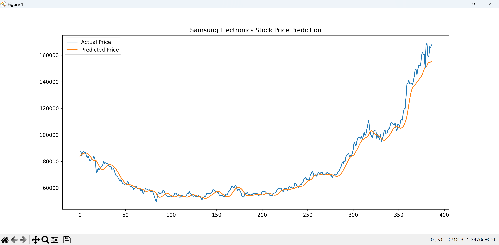

# 4. 주식 시장 데이터 기반 가격 예측(day5/step3 폴더 참조)

삼성전자의 주식 데이터를 활용하여 가격을 예측하는 가장 대표적인 방법은 **LSTM(Long Short-Term Memory)** 신경망을 사용하는 것입니다. LSTM은 과거의 흐름을 기억하는 특성이 있어 시계열 데이터인 주가 예측에 적합합니다.

---

### 1. 필수 라이브러리 설치

주가 데이터를 가져오기 위해 `FinanceDataReader`를, 데이터 처리를 위해 `pandas`와 `scikit-learn`을, 모델 생성을 위해 `tensorflow`를 사용합니다.

```bash
pip install finance-datareader pandas numpy matplotlib scikit-learn tensorflow

```

---

### 2. 삼성전자 주가 예측 전체 코드 (LSTM 모델)

파일명 : day5/step3/sastock_price_learning.py

```python
import pandas as pd
import numpy as np
import matplotlib.pyplot as plt
import FinanceDataReader as fdr
from sklearn.preprocessing import MinMaxScaler
from tensorflow.keras.models import Sequential
from tensorflow.keras.layers import LSTM, Dense, Dropout, Input

# 1. 데이터 수집 (삼성전자 종목코드: 005930)
# 2018년부터 현재까지의 데이터를 가져옵니다.
df = fdr.DataReader('005930', '2018-01-01')

# 2. 데이터 전처리
# '종가(Close)' 데이터만 사용하며, 0~1 사이로 정규화합니다.
scaler = MinMaxScaler(feature_range=(0, 1))
scaled_data = scaler.fit_transform(df['Close'].values.reshape(-1, 1))

# 3. 학습 데이터 생성
# 과거 60일간의 데이터를 보고 다음날 주가를 예측하도록 설정합니다.
window_size = 60
X, y = [], []

for i in range(window_size, len(scaled_data)):
    X.append(scaled_data[i-window_size:i, 0])
    y.append(scaled_data[i, 0])

X, y = np.array(X), np.array(y)
X = np.reshape(X, (X.shape[0], X.shape[1], 1))

# 학습용과 테스트용 분리 (최근 100일을 테스트용으로 사용)
train_size = int(len(X) * 0.8)
X_train, X_test = X[:train_size], X[train_size:]
y_train, y_test = y[:train_size], y[train_size:]

# 4. LSTM 모델 구축
model = Sequential([
    Input(shape=(X_train.shape[1], 1)),
    LSTM(units=50, return_sequences=True),
    Dropout(0.2),
    LSTM(units=50, return_sequences=False),
    Dropout(0.2),
    Dense(units=1)
])

model.compile(optimizer='adam', loss='mean_squared_error')
model.fit(X_train, y_train, epochs=20, batch_size=32)

# 5. 예측 및 결과 시각화
predictions = model.predict(X_test)
predictions = scaler.inverse_transform(predictions) # 정규화 되돌리기
actual = scaler.inverse_transform(y_test.reshape(-1, 1))

plt.figure(figsize=(12, 6))
plt.plot(actual, label='실제 가격')
plt.plot(predictions, label='예상 가격')
plt.title('삼성전자 주가 예측')
plt.legend()
plt.show()

```

실행결과



---

### 3. 주요 단계 설명

* **데이터 로드**: `FinanceDataReader`는 국내 주식 데이터를 가장 편리하게 가져올 수 있는 라이브러리입니다.
* **데이터 정규화**: 주가는 단위가 크기 때문에 과  사이의 값으로 변환해야 모델 학습이 안정적으로 이루어집니다.
* **Window Size (일)**: 인공지능이 오늘 가격을 정할 때 과거 며칠을 참고할지 결정하는 값입니다.
* **Dropout**: 모델이 학습 데이터에만 너무 과하게 적응(과적합)하는 것을 방지합니다.

> [!CAUTION]
> **주의사항**: 주식 가격은 거시 경제, 뉴스, 금리 등 수많은 변수에 영향을 받으므로, 단순히 과거 가격(시계열) 데이터만으로 예측하는 이 코드는 **참고용**으로만 활용하시길 권장합니다. 실제 투자에는 신중을 기하셔야 합니다!

[삼성전자 주가 예측 LSTM 튜토리얼](https://www.youtube.com/watch?v=Sm-YBPUe3qU)
이 영상은 페이스북의 Prophet 라이브러리를 사용해 삼성전자 주가를 예측하는 과정을 설명하고 있어, 머신러닝 모델과 결과를 비교해보기 좋습니다.
